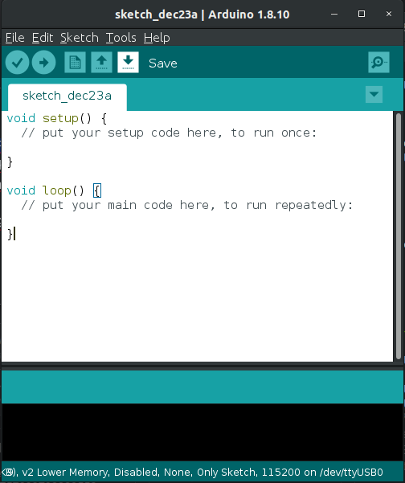

# Bab 8 - Android & NodeMCU MQTT


<br/><br/><br/><br/>

## Tujuan
Pada percobaan Bab ini, kalian akan memahami bagaimana perangkat Android dapat berkomunikasi dengan tiga perangkat sensor (NodeMCU) melalui protokol MQTT. Terdapat dua codelab, yaitu codelab NodeMCU dan Android. 

## Aplikasi Materi Bab 8 Pada Kehidupan Sehari-hari.
1. Sistem Kontrol Smart Home Berbasis Android.
2. Monitoring Suhu Ruangan Melalui Perangkat Android
3. ...dan ribuan kemungkinan lainnya 😊. Cocok untuk bahan PI & Skripsi SK.
<hr/>

## Teori
MQTT merupakan protokol pengiriman pesan machine-to-machine (M2M)/"Internet of Things" yang didesain untuk komunikasi antar perangkat dengan keterbatasan sumber daya, low-bandwith, atau perangkat pada jaringan yang tidak stabil dan high-latency. Prinsip desain dari protokol MQTT adalah untuk meminimalkan network bandwith dan sumber daya perangkat sementara tetap menjaga realibilitas serta jaminan pengiriman pesan. MQTT dikembangkan oleh Dr Andy Stanford-Clark dari IBM, dan Arlen Nipper dari Arcom (sekarang Eurotech) pada tahun 1999. 

#### Request-Response VS Publish-Subscribe (Pub/Sub)
  Umumnya, bentuk komunikasi komputer pada jaringan berbentuk request-response, sebuah komputer sebagai client meminta (request) data kepada server sehingga server merespon (reponse) permintaan tersebut dengan suatu data. Namun kelemahan dari bentuk komunikasi Request-Response adalah perangkat client tidak dapat secara langsung mengetahui adanya perubahan data pada server sehingga mengharuskan client untuk meminta data kepada server dalam secara terus-menerus pada suatu interval waktu. 

  Disinilah model komunikasi Publish-Subscribe (Pub/Sub) hadir untuk menangani masalah tersebut, dan MQTT merupakan salah-satu protokol yang menerapkan konsep ini. Anggap MQTT sebagai grup WhatsApp dari perangkat keras. Setiap perangkat keras harus terhubung pada suatu grup agar dapat saling berkomunikasi. Setiap perangkat keras dapat mengirimkan pesan ke grup **(publish)**, dan pada waktu yang sama setiap perangkat keras lainnya juga dapat menerima pesan yang dikirim tersebut **(subscribe)**. Grup disini bertindak sebagai **"Broker"**, yang berfungsi untuk menerima pesan masuk dan mengirimkannya kembali kepada seluruh perangkat keras yang terhubung (subscribers). Setiap grup memiliki nama, yang dimana dalam MQTT disebut sebagai **Topics**. Setiap perangkat harus terhubung ke Topics yang sama agar dapat saling berkomunikasi. Pada implementasinya, broker MQTT berbentuk suatu software yang berjalan pada komputer server. Salah satu software broker MQTT yang tersedia secara gratis yaitu Ecplise Mosquitto (https://mosquitto.org/). 
  
(IMG VISUALISASI PUBLISH SUBSCRIBE BROKER)
<hr/>

## Setup MQTT 
- Broker MQTT sudah tersedia. Tanyakan kepada asisten untuk alamat IP broker MQTT. Pastikan perangkat smartphone **terhubung pada jaringan WiFi lab** sebelum melakukan running test. 
- Referensi installasi Broker dan Client MQTT pada Ubuntu : https://www.vultr.com/docs/how-to-install-mosquitto-mqtt-broker-server-on-ubuntu-16-04

## Codelab NodeMCU MQTT Client
1. Buatlah sketch baru pada Arduino IDE. Sehingga akan muncul tampilan awal seperti ini : 


2. Tambahkan library `ESP8266Wifi` dan `PubSubClient` pada sketch yang sudah dibuat.

```c++
#include <ESP8266WiFi.h>
#include <PubSubClient.h>

void setup() {
  // put your setup code here, to run once:

}

void loop() {
  // put your main code here, to run repeatedly:

}
```
- Library `ESP8266Wifi` berfungsi untuk melakukan koneksi NodeMCU ke jaringan WiFi.
- Library `PubSubClient` berfungsi untuk menjadikan NodeMCU sebagai client dari broker MQTT.

3. Tambahkan beberapa variable yang dibutuhkan untuk konektifitas NodeMCU ke Wifi, state dari LED, dan interval pembacaan sensor LDR.
```c++ 
#include <ESP8266WiFi.h>
#include <PubSubClient.h>

const char* ssid = "Lab Lanjut 121";
const char* password = "TanyaAsisten";
const char* mqtt_server = "192.168.121.105";

bool ledState = LOW;
long lastMsg = 0;

void setup() {
  // put your setup code here, to run once:

}

void loop() {
  // put your main code here, to run repeatedly:

}
```
- Tanyakan isian `SSID_WIFI`, `PASSWORD_WIFI`, dan `ALAMAT_IP_BROKER` kepada asisten.

4. Inisialisasikan library yang sudah dimuat dengan menambahkan dua baris dibawah :
```c++ 
#include <ESP8266WiFi.h>
#include <PubSubClient.h>

const char* ssid = "Lab Lanjut 121";
const char* password = "TanyaAsisten";
const char* mqtt_server = "192.168.121.105";

bool ledState = LOW;
long lastMsg = 0;

// tambahkan dua baris dibawah ini
WiFiClient espClient;
PubSubClient client(espClient);

void setup() {
  // put your setup code here, to run once:

}

void loop() {
  // put your main code here, to run repeatedly:

}
```

5. Kemudian, buatlah fungsi `setup_wifi()` yang berfungsi untuk konfigurasi koneksi NodeMCU ke WiFi.
```c++ 
#include <ESP8266WiFi.h>
#include <PubSubClient.h>

...

void setup_wifi() {

  delay(10);
  
  Serial.println();
  Serial.print("Connecting to ");
  Serial.println(ssid);
  
  // Mencoba koneksi ke WiFi
  WiFi.begin(ssid, password);

  while (WiFi.status() != WL_CONNECTED) {
    delay(500);
    Serial.print(".");
  }

  randomSeed(micros());

  // Jika koneksi WiFi berhasil maka akan menampilkan teks dibawah pada Serial.
  Serial.println("");
  Serial.println("WiFi connected");
  Serial.println("IP address: ");
  Serial.println(WiFi.localIP());
}

void setup() {
  // put your setup code here, to run once:
}

void loop() {
  // put your main code here, to run repeatedly:
}
```
6. Kemudian, tambahkan baris program dibawah pada fungsi `setup()`. 
```c++ 
#include <ESP8266WiFi.h>
#include <PubSubClient.h>

...

void setup_wifi() {
 
 ...
 
}

void setup() {
  pinMode(D5, OUTPUT); // Menginisialisasikan pin D5 sebagai output
  
  Serial.begin(115200); // Set baud-rate komunikasi serial monitor sebesar 115200 bps.  
  setup_wifi(); // Memanggil fungsi setup_wifi() yang sudah dibuat sebelumnya
  
  // Print teks "connected" pada serial monitor jika koneksi ke WiFi berhasil.
  Serial.println("connected"); 
  
  // Menghubungkan NodeMCU kepada 
  client.setServer(mqtt_server, 1883);
  client.setCallback(callback);
}

void loop() {
  // put your main code here, to run repeatedly:
}
```

7. Lalu, buatlah fungsi `callback()`. Fungsi ini diperuntukan untuk menangani pesan masuk dari Broker (Subscribe).
```c++ 
#include <ESP8266WiFi.h>
#include <PubSubClient.h>

...

void setup_wifi() {
 
 ...
 
}

void callback(char* topic, byte* payload, unsigned int length) {
  Serial.print("Message arrived [");
  Serial.print(topic);
  Serial.print("] ");
  for (int i = 0; i < length; i++) {
    Serial.print((char)payload[i]);
  }
  Serial.println();

  // Switch on the LED if an 1 was received as first character
  Serial.print("payload ");
  Serial.println(payload[0]);
  if (payload[0] == '2') {
    if (payload[2] == 'a') digitalWrite(D5, !ledState);   
    ledState = !ledState;
  }
}

void setup() {
  ...
}

void loop() {
  // put your main code here, to run repeatedly:
}
```

8. Setalahnya, tambahkan fungsi `reconnect()` yang digunakan untuk memastikan perangkat NodeMCU dapat terhubung dengan broker MQTT. 
```c++ 
#include <ESP8266WiFi.h>
#include <PubSubClient.h>

...

void setup_wifi() {
 
 ...
 
}

void callback(char* topic, byte* payload, unsigned int length) {
  ...
}

void reconnect() {
  // Melakukan perulangan hingga NodeMCU berhasil terhubung dengan broker MQTT.
  while (!client.connected()) {
    Serial.print("Attempting MQTT connection...");
    
    // Membuat client ID secara acak 
    String clientId = "ESP8266Client-";
    clientId += String(random(0xffff), HEX);
   
    // Percobaan koneksi ke Broker MQTT.
    if (client.connect(clientId.c_str())) {
      Serial.println("connected");
      
      // Mencoba publish message ke Broker dengan topic "data" setelah terhubung  
      client.publish("data", "hello world");
      
      // Melakukan subscribe ke topik "command". 
      // Topik "command" berisikan perintah dari perangkat Android.
      client.subscribe("command");
      
    } else {
      Serial.print("failed, rc=");
      Serial.print(client.state());
      Serial.println(" try again in 5 seconds");
      
      // Delay 5 detik sebelum melakukan koneksi ulang.
      delay(5000);
    }
  }
}

void setup() {
  ...
}

void loop() {
  // put your main code here, to run repeatedly:
}
```

9. Maka sekarang kita bisa mengisikan baris kode pada fungsi `loop()`. Fungsi `loop()` akan menjalankan semua baris program didalamnya secara terus menerus selama perangkat hidup. 
```c++ 
#include <ESP8266WiFi.h>
#include <PubSubClient.h>

...

void setup_wifi() {
 ...
}

void callback(char* topic, byte* payload, unsigned int length) {
  ...
}

void reconnect() {
  ...
}

void setup() {
  ...
}

void loop() {
  
  // Memanggil fungsi reconnect() jika perangkat belum terhubung dengan MQTT Broker. 
  if (!client.connected()) {
    reconnect();
  }
  
  client.loop();

  // Mendapatkan waktu hidup perangkat dalam satuan millisecond.
  long now = millis();
  
  // Jika selisih waktu sudah 500 millisecond, maka jalankan perintah didalam blok if. 
  if (now - lastMsg > 500) {
    lastMsg = now;

    // Membaca nilai tegangan dari LDR dalam rentang 0-1023.
    int sensorValue = analogRead(A0);   // read the input on analog pin 0

    // Melakukan konversi satuan hasil baca analog (0-1023) menjadi voltage (0-5V). 
    float voltage = sensorValue * (3.3 / 1023.0);   

    // konversi nilai float tengangan menjadi array Char.
    char buf[8];
    sprintf(buf, "%f", voltage);

    // Menggabungkan nilai tegangan LDR dengan ID pengenal Perangkat. 
    char messageDelivered[10];
     
    /*
    Nilai ID perangkat menurut Warna LED : 
    
     ID_PERANGKAT | Warna LED
    --------------------------
         1        |    RED
         2        |    GREEN
         3        |    WHITE 
    */
    strcpy(messageDelivered,"ID_PERANGKAT");
    strcat(messageDelivered," ");
    strcat(messageDelivered,buf);
      
    // Mencetak message yang akan di publish ke broker pada serial monitor 
    Serial.print("Publish message: ");
    Serial.println(messageDelivered);
    
    // Publish message ke topic "data"
    client.publish("data", messageDelivered);
  }
}
```
10. Upload sketch ke perangkat NodeMCU. 

## Codelab Android MQTT Client
1. Buatlah project baru pada Android Studio dengan kriteria sebagai berikut : 

| Field     | Isian |
| ---      | ---       |
| Nama Project  | __MQTTClient__    |
| Target & Minimum Target SDK  | __Phone and Tablet, Api level 21__  |
| Tipe Activity | __Empty Activity__ |
| Activity Name | __MainActivity__ | 
| Language | __Java__ |

2. Ganti keseluruhan kode pada `activity_main.xml` dengan kode berikut : 
```xml
<?xml version="1.0" encoding="utf-8"?>
<androidx.constraintlayout.widget.ConstraintLayout xmlns:android="http://schemas.android.com/apk/res/android"
    xmlns:app="http://schemas.android.com/apk/res-auto"
    xmlns:tools="http://schemas.android.com/tools"
    android:layout_width="match_parent"
    android:layout_height="match_parent"
    tools:context=".MainActivity">

    <Button
        android:id="@+id/ledSwitchRed"
        android:layout_width="100dp"
        android:layout_height="86dp"
        android:layout_marginTop="28dp"
        android:text="@string/buttonLEDRed"
        app:layout_constraintEnd_toEndOf="parent"
        app:layout_constraintHorizontal_bias="0.215"
        app:layout_constraintStart_toStartOf="parent"
        app:layout_constraintTop_toTopOf="parent" />

    <Button
        android:id="@+id/ledSwitchGreen"
        android:layout_width="100dp"
        android:layout_height="86dp"
        android:layout_marginTop="28dp"
        android:layout_marginEnd="52dp"
        android:layout_marginRight="52dp"
        android:text="@string/buttonLEDGreen"
        app:layout_constraintEnd_toEndOf="parent"
        app:layout_constraintHorizontal_bias="0.847"
        app:layout_constraintStart_toEndOf="@+id/ledSwitchRed"
        app:layout_constraintTop_toTopOf="parent" />

    <Button
        android:id="@+id/ledSwitchWhite"
        android:layout_width="100dp"
        android:layout_height="86dp"
        android:layout_marginTop="140dp"
        android:text="@string/buttonLEDWhite"
        app:layout_constraintEnd_toEndOf="@+id/ledSwitchGreen"
        app:layout_constraintHorizontal_bias="0.494"
        app:layout_constraintStart_toStartOf="@+id/ledSwitchRed"
        app:layout_constraintTop_toTopOf="parent" />

    <TextView
        android:id="@+id/textViewRed"
        android:layout_width="wrap_content"
        android:layout_height="wrap_content"
        android:layout_marginTop="24dp"
        android:text="Menunggu Tegangan LDR ESP Merah"
        android:textSize="15dp"
        app:layout_constraintEnd_toEndOf="parent"
        app:layout_constraintStart_toStartOf="parent"
        app:layout_constraintTop_toBottomOf="@+id/ledSwitchWhite" />

    <TextView
        android:id="@+id/textViewGreen"
        android:layout_width="wrap_content"
        android:layout_height="wrap_content"
        android:layout_marginTop="20dp"

        android:text="Menunggu Tegangan LDR ESP Hijau"
        android:textSize="15dp"
        app:layout_constraintEnd_toEndOf="parent"
        app:layout_constraintStart_toStartOf="parent"
        app:layout_constraintTop_toBottomOf="@+id/textViewRed" />

    <TextView
        android:id="@+id/textViewWhite"
        android:layout_width="wrap_content"
        android:layout_height="wrap_content"

        android:layout_marginTop="16dp"
        android:text="Menunggu Tegangan LDR ESP Putih"
        android:textSize="15dp"
        app:layout_constraintEnd_toEndOf="parent"
        app:layout_constraintStart_toStartOf="parent"
        app:layout_constraintTop_toBottomOf="@+id/textViewGreen" />
</androidx.constraintlayout.widget.ConstraintLayout>
```
Sehingga tampilan layout activity_main menjadi seperti ini : 
(IMG HERE)

3. Download dua library `org.eclipse.paho.android.service-1.1.1.jar` dan `org.eclipse.paho.client.mqttv3-1.1.1.jar` pada folder libs di repository ini. Kemudian tambahkan kedua file tersebut ke folder libs yang ada di project Android Studio.

4. Tambahkan baris program dibawah pada build.gradle (App level) untuk implementasi library yang sudah ditambahkan pada folder libs project : 

```gradle
apply plugin: 'com.android.application'

android {
  ...
    }
    buildTypes {
        release {
            ...
        }
    }
}

dependencies {
    implementation fileTree(dir: 'libs', include: ['*.jar'])
    implementation 'androidx.appcompat:appcompat:1.0.2'
    implementation 'androidx.constraintlayout:constraintlayout:1.1.3'
    testImplementation 'junit:junit:4.12'
    androidTestImplementation 'androidx.test:runner:1.1.1'
    androidTestImplementation 'androidx.test.espresso:espresso-core:3.1.1'
    
    // Tambahkan dua baris progam dibawah ini
    implementation files('libs/org.eclipse.paho.android.service-1.1.1.jar')
    implementation files('libs/org.eclipse.paho.client.mqttv3-1.1.1.jar')
}
```
5. Kemudian, Klik tulisan "Sync Now" pada pojok kanan atas untuk melakukan sinkronisasi ulang. 

(IMG SYNC NOW DISINI)

6. Sekarang saatnya kita menambahkan program pada file `MainActivity.java`. Import kelas-kelas yang dibutuhkan untuk melakukan koneksi MQTT dengan menambahkan baris-bari dibawah ini : 

```java
package com.example.NAMA_PACKAGE;

import ...

import org.eclipse.paho.android.service.MqttAndroidClient;
import org.eclipse.paho.client.mqttv3.DisconnectedBufferOptions;
import org.eclipse.paho.client.mqttv3.IMqttActionListener;
import org.eclipse.paho.client.mqttv3.IMqttMessageListener;
import org.eclipse.paho.client.mqttv3.IMqttToken;
import org.eclipse.paho.client.mqttv3.MqttClient;

import org.eclipse.paho.client.mqttv3.MqttConnectOptions;
import org.eclipse.paho.client.mqttv3.MqttException;
import org.eclipse.paho.client.mqttv3.MqttMessage;
import org.eclipse.paho.client.mqttv3.MqttPersistenceException;
import org.eclipse.paho.client.mqttv3.persist.MemoryPersistence;

public class MainActivity extends AppCompatActivity {
  
  @Override
  protected void onCreate(Bundle savedInstanceState) {
        super.onCreate(savedInstanceState);
        setContentView(R.layout.activity_main);
  }
}
```
7. Tambahkan baris kode dibawah ini untuk menambahkan variable yang dibutuhkan berkaitan dengan View, nilai warna LED, dan variable client MQTT. 
```java
package com.example.NAMA_PACKAGE;

import ...

...

public class MainActivity extends AppCompatActivity {
  
  // Tambahkan baris dibawah ini
  public String color;
  public MqttAndroidClient client;
  public TextView textVoltageRed;
  public TextView textVoltageGreen;
  public TextView textVoltageWhite;
  public String val;
  public String vals[];
  
  @Override
  protected void onCreate(Bundle savedInstanceState) {
        super.onCreate(savedInstanceState);
        setContentView(R.layout.activity_main);
  }
}
```

8. Kemudian, tambahkan baris dibawah untuk menghubungkan view pada layout dengan kelas `MainActivity`. 
```java
package com.example.NAMA_PACKAGE;

import ...

...

public class MainActivity extends AppCompatActivity {
  
  ...
  
  @Override
  protected void onCreate(Bundle savedInstanceState) {
        super.onCreate(savedInstanceState);
        setContentView(R.layout.activity_main);
        
        Button ledSwitchRed = (Button) findViewById(R.id.ledSwitchRed);
        Button ledSwitchGreen = (Button) findViewById(R.id.ledSwitchGreen);
        Button ledSwitchWhite = (Button) findViewById(R.id.ledSwitchWhite);

        textVoltageRed = (TextView) findViewById(R.id.textViewRed);
        textVoltageGreen = (TextView) findViewById(R.id.textViewGreen);
        textVoltageWhite = (TextView) findViewById(R.id.textViewWhite);
  }
}
```

9. Kemudian tambahkan baris kode dibawah untuk menginisialisasikan `MemoryPresistent` dan kelas `MqttAndroidClient`. 
```java
package com.example.NAMA_PACKAGE;

import ...

...

public class MainActivity extends AppCompatActivity {
  
  ...
  
  @Override
  protected void onCreate(Bundle savedInstanceState) {
        ...
        
        final MemoryPersistence memPer = new MemoryPersistence();
        final String clientId = MqttClient.generateClientId();

        client = new MqttAndroidClient(
                this.getApplicationContext(),
                "tcp://192.168.121.104:1883",
                clientId,
                memPer);
  }
}
```
- 

