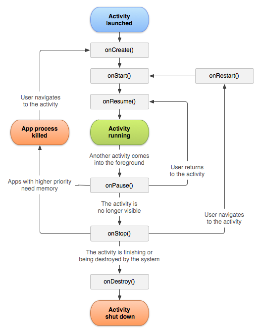
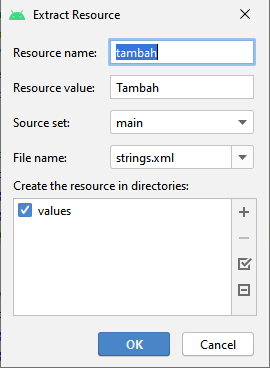
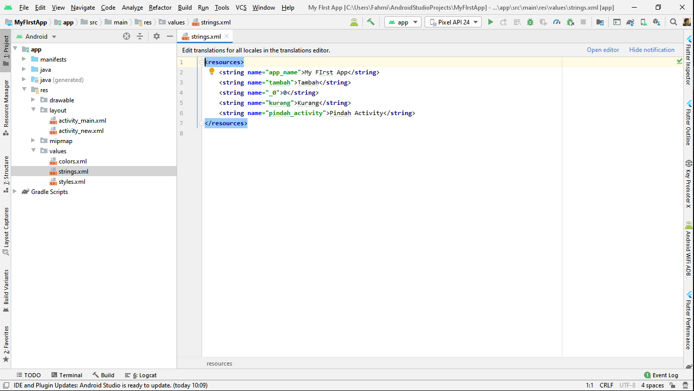
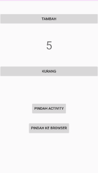
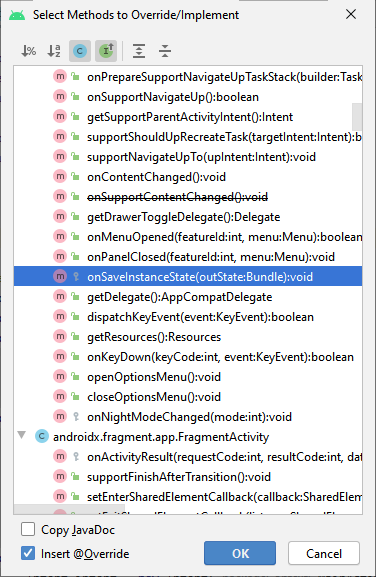
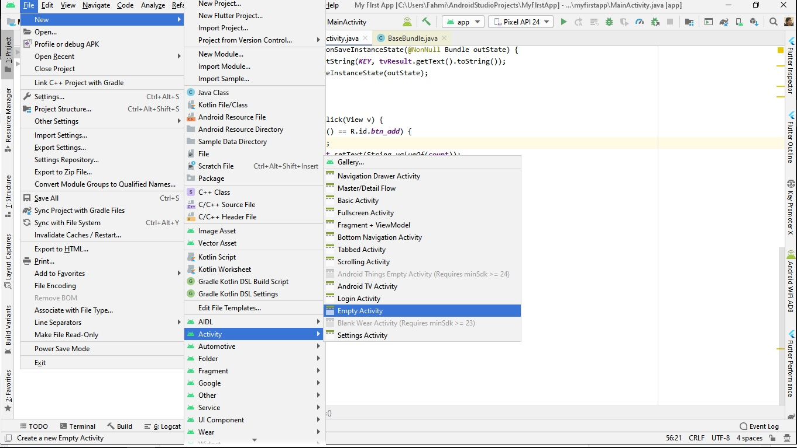
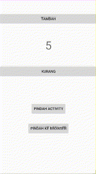
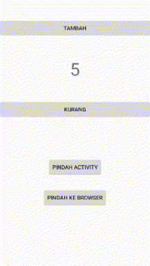
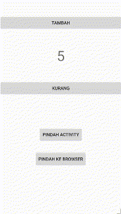

# Bab 1 - Activity Basics, OnSavedInstanceState & Intent


<a href="https://github.com/fahmisbas">
  
</a>
<a href="https://www.linkedin.com/in/fahmisbas/">
  
</a>


<br/><br/><br/><br/>

## Tujuan
Pada bab ini kalian akan memahami komponen utama dalam aplikasi Android yaitu Activity, dan dapat menggunakan Intent untuk melakukan navigasi antar Activity.
## Teori
### Pengenalan Activity
Activity dapat di katakan sebagai halaman/layar dalam aplikasi Android. Terdapat berbagai macam komponen UI (User Interface) di dalamnya seperti tombol, gambar, list, dan text yang di definisikan di dalam file layout berformat _xml_. Pengguna dapat berinteraksi dengan komponen-komponen tersebut seperti mengubah text atau menekan tombol untuk memicu sebuah event. Sebuah Activity terdiri dari file Java Class `.java` dan file layout `.xml`.

Activity merepresentasikan satu halaman/layar. Kita dapat mengambil contoh aplikasi Facebook, di mana aplikasi tersebut memiliki beberapa activity yaitu _Profile, Beranda, dan Pesan_. Setiap Activity merupakan komponen yang independen sehingga untuk melakukan navigasi antar Activity di butuhkan sebuah mekanisme. Hal tersebut dapat di penuhi dengan *Intent* yang akan di bahas di bab ini.

### Activity Lifecycle  
Setiap activity memiliki apa yang di sebut dengan *Activity Lifecycle*. Lihatlah diagram di bawah :
<p align="center">
  
</p>

*Activity Lifecycle* merupakan rangkaian *state* dari Activity. Kita dapat mengatur _behaviour_ Activity berdasarkan state yang sedang aktif menggunakan _Method Callback_. Terdapat 6 _Method Callback_ di dalam Activity yaitu `onCreate()` , `onStart()` , `onResume()` , `onPause()` , `onStop()` , dan `onDestroy()`.

Contoh penggunaan nya adalah ketika aplikasi pertama kali di buka, Activity utama akan di jalankan dan memasuki state *Create*. Maka `onCreate()` akan di panggil dan menjalankan kode di dalam nya seperti menampilkan layout menggunakan `setContentView()`. Method `onCreate()` wajib di miliki oleh sebuah Activity untuk melakukan inisialisasi awal.

Penjelasan lebih lanjut mengenai _Activity Lifecycle_ dapat di lihat di dalam link ini : https://developer.android.com/guide/components/activities/activity-lifecycle

### OnSavedInstanceState
Apabila sebuah Activity mengalami perubahan konfigurasi seperti perpindahan orientasi layar, maka Activity akan di hancurkan dengan memanggil `onDestroy()`. Selanjutnya Activity perlu di buat kembali dengan memanggil `onCreate()` untuk melakukan inisialisasi dengan orientasi yang berbeda. Ini menyebabkan data yang di simpan sebelumnya akan hilang. Untuk mengatasi hal tersebut kita dapat menggunakan method `onSaveInstanceState()`.

### Intent
Intent adalah sebuah object yang dapat digunakan untuk melakukan komunikasi antar komponen aplikasi seperti _Activity, Content Providers, Broadcast Receivers dan Services_. Intent memiliki dua tipe, yaitu 
_Explicit_ dan _Implicit_.

#### Intent Explicit
Di gunakan untuk memulai komponen di dalam aplikasi seperti Activity.

#### Intent Implicit
Di gunakan untuk memulai komponen di luar aplikasi, seperti kamera atau map.
<hr/>

## Setup Project Baru
Kita akan mengimpementasi teori diatas dengan membuat aplikasi penghitung sederhana. Sekarang buka Android Studio dan buat project baru dengan kriteria sebagai berikut.

| Field     | Isian |
| ---      | ---       |
| Nama Project  | **My First App**   |
| Target & Minimum Target SDK  | **Phone and Tablet, Api level 21**  |
| Tipe Activity | **Empty Activity** |
| Activity Name | **MainActivity** | 
| Language | **Java** |

<p align="left">
  
</p>

Setelah itu tekan tombol **Finish**.
Maka tampilan nya akan seperti ini.

<p align="left">
  
</p>

Kita akan menulis kode di dua buah file dengan format .`java` dan `.xml` yaitu __MainActivity.java__ dan __activity_main.xml__, dua kombinasi yang membentuk sebuah Activity. Android Studio sudah menyediakan secara otomatis saat kita membuat project baru dengan memilih _Empty Activity_ dan menjadikan nya Activity utama di dalam __AndroidManifest.xml__.

<p align="left">
  
</p>

Activity yang sudah di buat harus terdaftar di dalam __AndroidManifest.xml__ dengan menggunakan tag `<activity>` agar dapat di kenali dan di jalankan oleh sistem. 


<hr/>

## Codelab

1. Kita akan memasukkan komponen UI ke dalam __activity_main.xml__ terlebih dahulu, lalu memberikan fungsionalitasnya di dalam __MainActivity.java__.

Sekarang buka __activity_main.xml__ dan kondisikan layoutnya seperti di bawah ini :

<p align="left">
  
</p>

_*Ikuti arahan PJ dalam pemnbuatan layout._

Terdapat dua komponen UI di dalam aplikasi Android yaitu **ViewGroup** dan **View**. *ConstraintLayout* yang kita gunakan merupakan sebuah _ViewGroup_. _ViewGroup_ digunakan untuk menampung _View_ seperti *TextView, ImageView, Button dll* agar dapat di kelompokan dan di atur bagaimana mereka di posisikan. Sebut saja View di dalam ViewGroup sebagai _Child-View_.

*ConstraintLayout* digunakan untuk mengatur posisi _Child-View_ secara flexibel sehingga memudahkan kita untuk membuat layout yang complex tanpa perlu adanya nested layout (kelompok tampilan bertingkat). Untuk penjelasan lebih lanjut akan di lakukan di bab 2. 

Pembahasan mengenai _ViewGroup_ dan _View_ lebih lanjut dapat di lihat di dalam link ini : https://developer.android.com/guide/topics/ui/declaring-layout.

2. Perhatikan highlight kuning  pada `android:text`. Hightlight menandakan sebuah peringatan dalam hal ini kita meng-_hardcode_ nilai pada `android:text`. Kita dapat menghilangkan nya dengan cara klik pada highlight tersebut, lalu tekan *alt+enter*  dan pilih *extract string resource*. Klik tombol *OK*. 

<p align="left">
  
</p>

Lakukan pada semua `android:text` yang di highlight. Nilai yang di *extract* akan di masukan ke dalam __string.xml__ yang berada di __res/values__. 

<p align="left">
  
</p>

3. Selanjutnya buka __MainActivity__ lalu buat variabel instance sebagai berikut.

```java
  private Button btnAdd;
  private TextView tvResult;
  private Button btnSubstract;

  private int count = 0;
```

Inisialisasi variabel tersebut ke dalam method `onCreate()`.

```java
import...

public class MainActivity extends AppCompatActivity implements View.OnClickListener {

    private Button btnAdd;
    private TextView tvResult;
    private Button btnSubstract;
    
    private int count = 0;

    @Override
    protected void onCreate(Bundle savedInstanceState) {
        super.onCreate(savedInstanceState);
        setContentView(R.layout.activity_main);
        
        btnAdd = findViewById(R.id.btn_add);
        tvResult = findViewById(R.id.tv_result);
        btnSubstract = findViewById(R.id.btn_subtract);
    }
}
```
Kita baru saja menampung _View_ ke dalam variabel menggunakan `findViewById()`.

4. Implement Interface `OnClickListener` pada class __MainActivity__.

<p align="left">
  
</p>

Jika muncul garis merah, tekan *alt+enter* lalu *Implement Method*. Pilih method yang berasal dari `OnClickListener` dan klik tombol *OK*. Android Studio akan otomatis menyediakan method tersebut.

```java
@Override
public void onClick(View v) {

} 
```
`OnClickListener` berguna untuk mendeteksi *click event* pada *Button* dengan memberikan sebuah method bernama `onClick()` untuk meng _handle_ nya. Sekarang kita perlu meregistrasi `btnAdd` dan `btnSubstract` menggunakan `setOnClickListener()`.
```java
import...

public class MainActivity extends AppCompatActivity implements View.OnClickListener {

    ... 
    private Button btnAdd;
    private Button btnSubstract;

    protected void onCreate(Bundle savedInstanceState) {
      super.onCreate(savedInstanceState);
      setContentView(R.layout.activity_main);

      ...
   
      btnAdd.setOnClickListener(this); 
      btnSubstract.setOnClickListener(this);
    }
  
    @Override
    public void onClick(View v) {

    } 
}

```
Sehingga keseluruhan kode akan seperti ini.
```java
import ...

public class MainActivity extends AppCompatActivity implements View.OnClickListener {

   private Button btnAdd;
   private TextView tvResult;
   private Button btnSubstract;

   private int count = 0;

   @Override
   protected void onCreate(Bundle savedInstanceState) {
       super.onCreate(savedInstanceState);
       setContentView(R.layout.activity_main);

       btnAdd = findViewById(R.id.btn_add);
       tvResult = findViewById(R.id.tv_result);
       btnSubstract = findViewById(R.id.btn_subtract);

       btnAdd.setOnClickListener(this);
       btnSubstract.setOnClickListener(this);
   }

   @Override
   public void onClick(View v) {

   }
}
```
5. Sekarang masukan kode berikut di dalam method `onClick()`.
 ```java
import ...

public class MainActivity extends AppCompatActivity implements View.OnClickListener {

   ...

   @Override
    public void onClick(View v) {
        switch (v.getId()) {
            case R.id.btn_add:
                count++;
                tvResult.setText(Integer.toString(count));
                break;
            case R.id.btn_subtract:
                count--;
                if (count < 0) {
                    count = 0;
                }
                tvResult.setText(Integer.toString(count));
                break;
        }
    }
}
```

Hal yang perlu di ingat adalah *TextView* hanya menerima *String*. Karena variable `count` bertipe *Integer* maka kita perlu mengkonversikan nya kedalam *String* menggunakan `Integer.toString()`.

Sekarang jalankan program nya menggunakan emulator atau smartphone. Pastikan USB Debugging sudah di aktifkan.
Tampilan nya akan seperti ini. 

<p align="left">
  
</p>

Tekan tombol tambah dan kurang, maka `tvResult` akan menampilkan hasilnya.

6. Sekarang coba ganti orientasi layar, maka nilai `tvResult` akan kembali ke 0. Agar nilainya tidak berubah kita dapat memanfaatkan method `onSaveInstanceState`. Override method `onSaveInstanceState()` dengan cara __click kanan__ di dalam __MainActivity__, kemudian __Generate -> Override Methods__. Cari dan pilih method `onSaveInstanceState()` dengan parameter _Bundle outState_ dan _return type void_ kemudian Tekan tombol "OK".

<p align="left">
  
</p>

Selanjutnya masukan kode ini di dalam method tersebut
```java
outState.putInt("result", count);
```
Sehingga `onSaveInstanceState()` akan menjadi seperti ini
```java
import ...

public class MainActivity extends AppCompatActivity implements View.OnClickListener {

   ...

    @Override
    protected void onSaveInstanceState(@NonNull Bundle outState) {
        outState.putInt("result", count);
        super.onSaveInstanceState(outState);
    }
}
```
Kita baru saja menyimpan nilai yang akan di tampilkan `tvResult`  ke dalam objek `Bundle` dalam bentuk *key-value*. Nilai tersebut akan terus tersimpan walaupun terjadi perubahan orientasi. Sekarang masukkan kode ini ke dalam method `onCreate()`.
 ```java

    
import ...

public class MainActivity extends AppCompatActivity implements View.OnClickListener {

  ...
  
    @Override
    protected void onCreate(Bundle savedInstanceState) {
        super.onCreate(savedInstanceState);
        setContentView(R.layout.activity_main);

        ...
       
        if (savedInstanceState != null) {
            count = savedInstanceState.getInt("result");
            tvResult.setText(Integer.toString(count));
        }
    }
    
    ...
}
```   
Sekarang coba di jalankan kembali dan ubah orientasi. Nilai yang tampil di `tvResult` tidak akan berubah.

<p align="left">
  
</p>

7. Selanjutnya kita akan menggunakan __Intent__ untuk melakukan navigasi ke Activity baru (Explicit).

Buat Activity baru dengan cara click menu __File__ pada toolbar lalu __New -> Activity. -> Empty Activity.__
<p align="left">
  
</p>

Buat dengan kriteria sebagai berikut:

| Field     | Isian |
| ---      | ---       |
| Activity Name | **NewActivity**   |
| Layout Name | **activity_new** |
| Language | **Java** |

8. Buka layout __activity_new.xml__ dan kondisikan layoutnya seperti di bawah ini.

<p align="left">
  
</p>

9. Selanjutnya buka class __MainActivity__, buat variabel instance sebagai berikut.
```java
private Button btnMoveActivity;
```
Inisialisasi dan registrasi variable tersebut di dalam method `onCreate()`.
```java
import ...
  
public class MainActivity extends AppCompatActivity implements View.OnClickListener {

    private Button btnMoveActivity;
  
    @Override
    protected void onCreate(Bundle savedInstanceState) {
        super.onCreate(savedInstanceState);
        setContentView(R.layout.activity_main);
        
        ...
        
        btnMoveActivity = findViewById(R.id.btn_moveActivity);
        btnMoveActivity.setOnClickListener(this);
    }
}
```
Masukan kode berikut ke dalam blok _switch_ yang berada di dalam method `onClick()`.

```java
import ...

public class MainActivity extends AppCompatActivity implements View.OnClickListener {

    ...
    
    @Override
    public void onClick(View v) {
        switch (v.getId()) {
            
            ...
            
            case R.id.btn_moveActivity:
                Intent intent = new Intent(MainActivity.this, NewActivity.class);
                startActivity(intent);
                break;
        }
    }
}
```
Sekarang jalankan programnya dan lakukan perpindahan Activity.

<p align="left">
  
</p>

10.  Kita sudah berhasil melakukan perpindahan Activity. Selanjutnya kita akan melakukan perpindahan Activity sekaligus membawa data menggunakan method `putExtra()` dengan parameter *key-value*.
Sehingga akan terlihat seperti ini.

```java
import ...

public class MainActivity extends AppCompatActivity implements View.OnClickListener {

    ...
    
   @Override
    public void onClick(View v) {
        switch (v.getId()) {
            
            ...
            
            case R.id.btn_moveActivity:
                Intent intent = new Intent(MainActivity.this, NewActivity.class);
                intent.putExtra("Extra_text","di kirim dari MainActivity"); // Intent membawa data
                startActivity(intent);
                break;
        }
    }
}
```
11. Agar activity yang di tuju dapat menerima data, kita perlu menulis beberapa baris kode.
Buka class __NewActivity__ dan buat variabel instance sebagai berikut.
```java
private TextView tvTitle;
```
inisialisasi variabel tersebut di dalam method `onCreate()`.

```java
import ...

public class NewActivity extends AppCompatActivity {

    private TextView tvTitle;

    @Override
    protected void onCreate(Bundle savedInstanceState) {
        super.onCreate(savedInstanceState);
        setContentView(R.layout.activity_new);

        tvTitle = findViewById(R.id.tv_title);
    }
}
```
Kita akan menggunakan `tvTitle` untuk menampilkan data.
Sekarang tambahkan kode ini :
```java
String dataReceived = getIntent().getStringExtra("Extra_text");
tvTitle.setText(dataReceived);
```
Sehingga keseluruhan kode pada __NewActivity__ akan seperti ini :

```java
import ...

public class NewActivity extends AppCompatActivity {

    private TextView tvTitle;

    @Override
    protected void onCreate(Bundle savedInstanceState) {
        super.onCreate(savedInstanceState);
        setContentView(R.layout.activity_new);

        tvTitle = findViewById(R.id.tv_title);

        String dataReceived = getIntent().getStringExtra("Extra_text");
        tvTitle.setText(dataReceived);

    }
}
```

Jalankan kembali program nya dan lakukan perpindahan activity.
Maka yang akan tampil di __NewActivity__ adalah data yang di kirim melalui intent.

<p align="left">
  
</p>

12. Yang terkhir, kita akan melakukan _Intent implicit_ untuk melakukan navigasi ke aplikasi lain.
Kali ini kita akan melakukannya dengan browser. Sekarang buka class __MainActivity__ dan buat variabel instance sebagai berikut :
```java
private Button btnToBrowser;
```
Inisialisasi dan registrasi variabel tersebut kedalam method `onCreate()`.
```java
import...

public class MainActivity extends AppCompatActivity implements View.OnClickListener {

   ...
   private Button btnToBrowser;

   @Override
    protected void onCreate(Bundle savedInstanceState) {
        super.onCreate(savedInstanceState);
        setContentView(R.layout.activity_main);
        
        ...
      
        btnToBrowser = findViewById(R.id.btn_toBrowser);
        btnToBrowser.setOnClickListener(this);

    }
}
```
Masukan kode ini di dalam blok _switch_ yang berada di method `onClick()`.

```java
import...

public class MainActivity extends AppCompatActivity implements View.OnClickListener {

    ...
   
    @Override
    public void onClick(View v) {
        switch (v.getId()) {  

            ...
            
            case R.id.btn_toBrowser:
                Intent toBrowser = new Intent(Intent.ACTION_VIEW, Uri.parse("https://www.google.com"));
                startActivity(toBrowser);
                break;
        }
    }
    
}
```
Jalankan program nya dan lakukan navigasi. Maka aplikasi akan otomatis membuka Browser dan membuka Google.

<p align="left">
  
</p>

Kita sudah berhasil membuat aplikasi penghitung sederhana dan melakukan navigasi menggunakan __Intent__. Maka Keseluruhan kode pada __MainActivity__ dan __NewActivity__ akan terlihat seperti ini :

`MainActivity.java`
```java
public class MainActivity extends AppCompatActivity implements View.OnClickListener {

    private Button btnAdd;
    private TextView tvResult;
    private Button btnSubstract;
    private Button btnMoveActivity;
    private Button btnToBrowser;

    private int count = 0;

    @Override
    protected void onCreate(Bundle savedInstanceState) {
        super.onCreate(savedInstanceState);
        setContentView(R.layout.activity_main);

        btnAdd = findViewById(R.id.btn_add);
        tvResult = findViewById(R.id.tv_result);
        btnSubstract = findViewById(R.id.btn_subtract);
        btnMoveActivity = findViewById(R.id.btn_moveActivity);
        btnToBrowser = findViewById(R.id.btn_toBrowser);

        btnAdd.setOnClickListener(this);
        btnSubstract.setOnClickListener(this);
        btnMoveActivity.setOnClickListener(this);
        btnToBrowser.setOnClickListener(this);

        if (savedInstanceState != null) {
            count = savedInstanceState.getInt("result");
            tvResult.setText(Integer.toString(count));
        }
    }

    @Override
    protected void onSaveInstanceState(@NonNull Bundle outState) {
        outState.putInt("result", count);
        super.onSaveInstanceState(outState);
    }

    @Override
    public void onClick(View v) {
        switch (v.getId()) {
            case R.id.btn_add:
                count++;
                tvResult.setText(Integer.toString(count));
                break;
            case R.id.btn_subtract:
                count--;
                if (count < 0) {
                    count = 0;
                }
                tvResult.setText(Integer.toString(count));
                break;
            case R.id.btn_moveActivity:
                Intent intent = new Intent(MainActivity.this, NewActivity.class);
                intent.putExtra("Extra_text","di kirim dari MainActivity");
                startActivity(intent);
                break;
            case R.id.btn_toBrowser:
                Intent toBrowser = new Intent(Intent.ACTION_VIEW, Uri.parse("https://www.google.com"));
                startActivity(toBrowser);
                break;
        }
    }
}
```
`NewActivity.java`
```java
public class NewActivity extends AppCompatActivity {

    private TextView tvTitle;

    @Override
    protected void onCreate(Bundle savedInstanceState) {
        super.onCreate(savedInstanceState);
        setContentView(R.layout.activity_new);

        tvTitle = findViewById(R.id.tv_title);

        String dataReceived = getIntent().getStringExtra("Extra_text");
        tvTitle.setText(dataReceived);

    }
}
```


