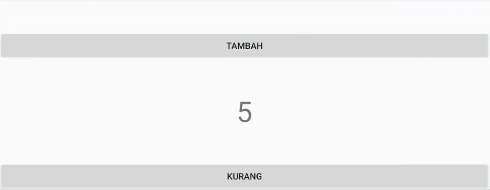

# Bab 1 - Activity Basics, OnSavedInstanceState & Intent


<a href="https://github.com/fahmisbas">
  
</a>
<a href="https://www.linkedin.com/in/fahmisbas/">
  
</a>


<br/><br/><br/><br/>

## Tujuan
Pada bab ini kalian akan memahami komponen utama dalam Aplikasi Android yaitu Activity, dan dapat menggunakan Intent untuk melakukan navigasi antar Activity.
## Teori
### Pengenalan Activity
Activity dapat dikatakan sebagai halaman/layar dalam Aplikasi Android. Terdapat berbagai macam komponen UI (User Interface) di dalamnya seperti Tombol, Gambar, List, dan Text yang didefinisikan di dalam file Layout berformat _xml_. Pengguna dapat berinteraksi dengan komponen-komponen tersebut seperti mengubah Text atau menekan Tombol untuk memicu sebuah Event. Sebuah Activity terdiri dari file Java Class `.java` dan file layout `.xml`.

Activity merepresentasikan satu halaman/layar. Kita dapat mengambil contoh Aplikasi Facebook, dimana Aplikasi tersebut memiliki beberapa Activity yaitu Profile, Beranda, dan Pesan. Setiap Activity merupakan komponen yang independen sehingga untuk melakukan navigasi antar Activity di butuhkan sebuah mekanisme. Hal tersebut dapat dipenuhi dengan *Intent* yang akan dibahas di bab ini.

### Activity Lifecycle  
Setiap Activity memiliki apa yang disebut dengan *Activity Lifecycle*. Lihatlah diagram di bawah :
<p align="center">
  
</p>

*Activity Lifecycle* merupakan rangkaian *State* dari Activity. Kita dapat mengatur _Behaviour_ Activity berdasarkan state yang sedang aktif menggunakan _Method Callback_. Terdapat 6 _Method Callback_ di dalam Activity yaitu `onCreate()` , `onStart()` , `onResume()` , `onPause()` , `onStop()` , dan `onDestroy()`.

Contoh penggunaan nya adalah ketika Aplikasi pertama kali dibuka, Activity utama akan dijalankan dan memasuki state *Create*. Maka `onCreate()` akan dipanggil dan menjalankan kode di dalamnya seperti menampilkan Layout menggunakan `setContentView()`.  `onCreate()` wajib dimiliki oleh sebuah Activity untuk melakukan inisialisasi awal.

Penjelasan lebih lanjut mengenai _Activity Lifecycle_ dapat dilihat di dalam link ini : https://developer.android.com/guide/components/activities/activity-lifecycle

### OnSavedInstanceState
Apabila sebuah Activity mengalami perubahan konfigurasi seperti perpindahan orientasi layar, maka Activity akan dihancurkan dengan memanggil `onDestroy()`. Selanjutnya Activity perlu dibuat kembali dengan memanggil `onCreate()` untuk melakukan inisialisasi dengan orientasi yang berbeda. Ini menyebabkan data yang disimpan sebelumnya akan hilang. Untuk mengatasi hal tersebut kita dapat menggunakan `onSaveInstanceState()`.

### Intent
Intent adalah sebuah object yang dapat digunakan untuk melakukan komunikasi antar komponen Aplikasi seperti _Activity, Content Provider, Broadcast Receiver dan Service_. Intent memiliki dua tipe, yaitu 
_Explicit_ dan _Implicit_.

#### Intent Explicit
Digunakan untuk memulai komponen di dalam Aplikasi seperti Activity.

#### Intent Implicit
Digunakan untuk memulai komponen di luar Aplikasi, seperti Kamera atau Map.
<hr/>

## Setup Project Baru
Kita akan mengimpementasi teori di atas dengan membuat Aplikasi penghitung sederhana. Sekarang buka Android Studio dan buat project baru dengan kriteria sebagai berikut.

| Field     | Isian |
| ---      | ---       |
| Nama Project  | **My First App**   |
| Target & Minimum Target SDK  | **Phone and Tablet, Api level 21**  |
| Tipe Activity | **Empty Activity** |
| Activity Name | **MainActivity** | 
| Language | **Java** |

<p align="left">
  
</p>

Setelah itu tekan tombol **Finish**.
Maka tampilan nya akan seperti ini.

<p align="left">
  
</p>

Kita akan menulis kode di dua buah file dengan format .`java` dan `.xml` yaitu __MainActivity.java__ dan __activity_main.xml__, dua kombinasi yang membentuk sebuah Activity. Android Studio sudah menyediakan secara otomatis saat kita membuat project baru dengan memilih _Empty Activity_ dan menjadikan nya Activity utama di dalam __AndroidManifest.xml__.

<p align="left">
  
</p>

Activity yang sudah dibuat harus terdaftar di dalam `AndroidManifest.xml` dengan menggunakan tag `<activity>` agar dapat dikenali dan dijalankan oleh sistem. 

<hr/>

## Codelab

1. Kita akan memasukkan komponen UI ke dalam `activity_main.xml` terlebih dahulu, lalu memberikan fungsionalitasnya di dalam `MainActivity.java`.

Sekarang buka `activity_main.xml` dan kondisikan Layout-nya seperti di bawah ini :

<p align="left">
  
</p>

_*Ikuti arahan PJ dalam pemnbuatan layout._

Terdapat dua komponen UI di dalam Aplikasi Android yaitu ViewGroup dan View. ConstraintLayout yang kita gunakan merupakan salah satu dari ViewGroup. ViewGroup digunakan untuk menampung View seperti TextView, ImageView, dan Button agar dapat dikelompokan dan diatur bagaimana mereka diposisikan. Sebut saja View di dalam ViewGroup sebagai child-view.

ConstraintLayout digunakan untuk mengatur posisi child-view secara flexibel sehingga memudahkan kita dalam membuat layout yang kompleks tanpa perlu adanya Nested-Layout (Kelompok Tampilan Bertingkat). Penjelasan lebih lanjut akan dilakukan di bab 2. 

Pembahasan mengenai ViewGroup dan View lebih lanjut dapat dilihat di dalam link ini : https://developer.android.com/guide/topics/ui/declaring-layout.

2. Perhatikan highlight kuning  pada `android:text`. Hightlight menandakan sebuah peringatan, dalam hal ini kita melakukan _hardcode_ nilai pada `android:text`. Kita dapat menghilangkan nya dengan cara klik pada highlight tersebut, lalu tekan __Alt+Enter__  dan pilih *Extract string resource*. Klik tombol *OK*. 

<p align="left">
  
</p>

Lakukan pada semua `android:text` yang dihighlight. Nilai yang di-extract akan dimasukan ke dalam `string.xml` yang berada di __res/values__. 

<p align="left">
  
</p>

3. Selanjutnya buka __MainActivity__ lalu deklarasikan variabel sebagai berikut.

```java
  private Button btnAdd;
  private TextView tvResult;
  private Button btnSubstract;

  private int count = 0;
```

Inisialisasi variabel tersebut ke dalam `onCreate()`.

```java
import...

public class MainActivity extends AppCompatActivity implements View.OnClickListener {

    private Button btnAdd;
    private TextView tvResult;
    private Button btnSubstract;
    
    private int count = 0;

    @Override
    protected void onCreate(Bundle savedInstanceState) {
        super.onCreate(savedInstanceState);
        setContentView(R.layout.activity_main);
        
        btnAdd = findViewById(R.id.btn_add);
        tvResult = findViewById(R.id.tv_result);
        btnSubstract = findViewById(R.id.btn_subtract);
    }
}
```
Kita baru saja menampung __View__ ke dalam variabel menggunakan `findViewById()`.

4. Implement Interface `OnClickListener` pada class __MainActivity__.

<p align="left">
  
</p>

Jika muncul garis merah, tekan *Alt+Enter* lalu *Implement Method*. Pilih Method yang berasal dari `OnClickListener` dan klik tombol *OK*. Android Studio akan otomatis menyediakan Method tersebut.

```java
@Override
public void onClick(View v) {

} 
```
`OnClickListener` berguna untuk mendeteksi klik pada __Button__ dengan memberikan sebuah Method bernama `onClick()` untuk menanganinya. Sekarang kita perlu me-registrasi `btnAdd` dan `btnSubstract` menggunakan `setOnClickListener()`.
```java
import...

public class MainActivity extends AppCompatActivity implements View.OnClickListener {

    ... 
    private Button btnAdd;
    private Button btnSubstract;

    protected void onCreate(Bundle savedInstanceState) {
      super.onCreate(savedInstanceState);
      setContentView(R.layout.activity_main);

      ...
   
      btnAdd.setOnClickListener(this); 
      btnSubstract.setOnClickListener(this);
    }
  
    @Override
    public void onClick(View v) {

    } 
}

```
Sehingga keseluruhan kode akan seperti ini.
```java
import ...

public class MainActivity extends AppCompatActivity implements View.OnClickListener {

   private Button btnAdd;
   private TextView tvResult;
   private Button btnSubstract;

   private int count = 0;

   @Override
   protected void onCreate(Bundle savedInstanceState) {
       super.onCreate(savedInstanceState);
       setContentView(R.layout.activity_main);

       btnAdd = findViewById(R.id.btn_add);
       tvResult = findViewById(R.id.tv_result);
       btnSubstract = findViewById(R.id.btn_subtract);

       btnAdd.setOnClickListener(this);
       btnSubstract.setOnClickListener(this);
   }

   @Override
   public void onClick(View v) {

   }
}
```
5. Sekarang masukan kode berikut di dalam Method `onClick()`.
 ```java
import ...

public class MainActivity extends AppCompatActivity implements View.OnClickListener {

   ...

   @Override
    public void onClick(View v) {
        switch (v.getId()) {
            case R.id.btn_add:
                count++;
                tvResult.setText(Integer.toString(count));
                break;
            case R.id.btn_subtract:
                count--;
                if (count < 0) {
                    count = 0;
                }
                tvResult.setText(Integer.toString(count));
                break;
        }
    }
}
```

Hal yang perlu diingat adalah, `TextView` hanya menerima `String`. Karena variable `count` bertipe *Integer* maka kita perlu meng-konversi kedalam `String` menggunakan `Integer.toString()`.

Sekarang jalankan program nya menggunakan Emulator atau Smartphone. Pastikan USB Debugging sudah diaktifkan.
Tampilan nya akan seperti ini. 

<p align="left">
  
</p>

Tekan tombol tambah dan kurang, maka `tvResult` akan menampilkan hasilnya.

6. Sekarang coba ganti orientasi layar, maka nilai `tvResult` akan kembali ke 0. Agar nilainya tidak berubah kita dapat memanfaatkan Method `onSaveInstanceState()`. _Override_ Method `onSaveInstanceState()` dengan cara __klik kanan__ di dalam `MainActivity`, kemudian __Generate -> Override Methods__. Cari dan pilih Method `onSaveInstanceState()` dengan parameter __Bundle outState__ dan return type __void__ kemudian Tekan tombol "OK".

<p align="left">
  
</p>

Selanjutnya masukan kode ini di dalam `onSaveInstanceState()`.
```java
outState.putInt("result", count);
```
Sehingga `onSaveInstanceState()` akan menjadi seperti ini
```java
import ...

public class MainActivity extends AppCompatActivity implements View.OnClickListener {

   ...

    @Override
    protected void onSaveInstanceState(@NonNull Bundle outState) {
        outState.putInt("result", count);
        super.onSaveInstanceState(outState);
    }
}
```
Kita baru saja menyimpan nilai yang akan ditampilkan `tvResult`  ke dalam objek `Bundle` dalam bentuk *key-value*. Nilai tersebut akan terus tersimpan walaupun terjadi perubahan orientasi. Sekarang masukkan kode ini ke dalam Method `onCreate()`.
 ```java

    
import ...

public class MainActivity extends AppCompatActivity implements View.OnClickListener {

  ...
  
    @Override
    protected void onCreate(Bundle savedInstanceState) {
        super.onCreate(savedInstanceState);
        setContentView(R.layout.activity_main);

        ...
       
        if (savedInstanceState != null) {
            count = savedInstanceState.getInt("result");
            tvResult.setText(Integer.toString(count));
        }
    }
    
    ...
}
```   
Sekarang coba dijalankan kembali dan ubah orientasi. Nilai yang tampil di `tvResult` tidak akan berubah.

<p align="left">
  
</p>

7. Selanjutnya kita akan menggunakan __Intent__ untuk melakukan navigasi ke Activity baru (Explicit).

Buat Activity baru dengan cara click menu __File__ pada toolbar lalu __New -> Activity. -> Empty Activity.__
<p align="left">
  
</p>

Buat dengan kriteria sebagai berikut:

| Field     | Isian |
| ---      | ---       |
| Activity Name | **NewActivity**   |
| Layout Name | **activity_new** |
| Language | **Java** |

8. Buka layout __activity_new.xml__ dan kondisikan layoutnya seperti di bawah ini.

<p align="left">
  
</p>

9. Selanjutnya buka class __MainActivity__, dan deklarasikan variabel baru sebagai berikut.
```java
private Button btnMoveActivity;
```
Inisialisasi dan registrasi variable tersebut di dalam Method `onCreate()`.
```java
import ...
  
public class MainActivity extends AppCompatActivity implements View.OnClickListener {

    private Button btnMoveActivity;
  
    @Override
    protected void onCreate(Bundle savedInstanceState) {
        super.onCreate(savedInstanceState);
        setContentView(R.layout.activity_main);
        
        ...
        
        btnMoveActivity = findViewById(R.id.btn_moveActivity);
        btnMoveActivity.setOnClickListener(this);
    }
}
```
Masukan kode berikut ke dalam blok _switch_ yang berada di dalam Method `onClick()`.

```java
import ...

public class MainActivity extends AppCompatActivity implements View.OnClickListener {

    ...
    
    @Override
    public void onClick(View v) {
        switch (v.getId()) {
            
            ...
            
            case R.id.btn_moveActivity:
                Intent intent = new Intent(MainActivity.this, NewActivity.class);
                startActivity(intent);
                break;
        }
    }
}
```
Sekarang jalankan programnya dan lakukan perpindahan Activity.

<p align="left">
  
</p>

10.  Kita sudah berhasil melakukan perpindahan Activity. Selanjutnya kita akan melakukan perpindahan Activity sekaligus membawa data menggunakan Method `putExtra()` dengan parameter *key-value*.
Sehingga akan terlihat seperti ini.

```java
import ...

public class MainActivity extends AppCompatActivity implements View.OnClickListener {

    ...
    
   @Override
    public void onClick(View v) {
        switch (v.getId()) {
            
            ...
            
            case R.id.btn_moveActivity:
                Intent intent = new Intent(MainActivity.this, NewActivity.class);
                intent.putExtra("Extra_text","di kirim dari MainActivity"); // Intent membawa data
                startActivity(intent);
                break;
        }
    }
}
```
11. Agar Activity yang dituju dapat menerima data, kita perlu menulis beberapa baris kode.
Buka class __NewActivity__ dan deklarasikan variabel baru sebagai berikut.
```java
private TextView tvTitle;
```
inisialisasi variabel tersebut di dalam Method `onCreate()`.

```java
import ...

public class NewActivity extends AppCompatActivity {

    private TextView tvTitle;

    @Override
    protected void onCreate(Bundle savedInstanceState) {
        super.onCreate(savedInstanceState);
        setContentView(R.layout.activity_new);

        tvTitle = findViewById(R.id.tv_title);
    }
}
```
Kita akan menggunakan `tvTitle` untuk menampilkan data.
Sekarang tambahkan kode berikut :
```java
String dataReceived = getIntent().getStringExtra("Extra_text");
tvTitle.setText(dataReceived);
```
Sehingga keseluruhan kode pada `NewActivity` akan seperti ini :

```java
import ...

public class NewActivity extends AppCompatActivity {

    private TextView tvTitle;

    @Override
    protected void onCreate(Bundle savedInstanceState) {
        super.onCreate(savedInstanceState);
        setContentView(R.layout.activity_new);

        tvTitle = findViewById(R.id.tv_title);

        String dataReceived = getIntent().getStringExtra("Extra_text");
        tvTitle.setText(dataReceived);

    }
}
```

Jalankan kembali program nya dan lakukan perpindahan Activity.
Maka yang akan tampil di `NewActivity` adalah data yang dikirim melalui intent.

<p align="left">
  
</p>

12. Yang terkhir, kita akan melakukan __Intent Implicit__ untuk melakukan navigasi ke Aplikasi lain.
Kali ini kita akan melakukannya dengan browser. Sekarang buka class `MainActivity` dan deklarasikan variabel baru sebagai berikut :
```java
private Button btnToBrowser;
```
Inisialisasi dan registrasi variabel tersebut kedalam Method `onCreate()`.
```java
import...

public class MainActivity extends AppCompatActivity implements View.OnClickListener {

   ...
   private Button btnToBrowser;

   @Override
    protected void onCreate(Bundle savedInstanceState) {
        super.onCreate(savedInstanceState);
        setContentView(R.layout.activity_main);
        
        ...
      
        btnToBrowser = findViewById(R.id.btn_toBrowser);
        btnToBrowser.setOnClickListener(this);

    }
}
```
Masukan kode ini di dalam blok _switch_ yang berada di Method `onClick()`.

```java
import...

public class MainActivity extends AppCompatActivity implements View.OnClickListener {

    ...
   
    @Override
    public void onClick(View v) {
        switch (v.getId()) {  

            ...
            
            case R.id.btn_toBrowser:
                Intent toBrowser = new Intent(Intent.ACTION_VIEW, Uri.parse("https://www.google.com"));
                startActivity(toBrowser);
                break;
        }
    }
    
}
```
Jalankan Program nya dan lakukan navigasi. Maka Aplikasi akan otomatis membuka Browser dan membuka Google.

<p align="left">
  
</p>

Kita sudah berhasil membuat Aplikasi penghitung sederhana dan melakukan navigasi menggunakan __Intent__. Maka Keseluruhan kode pada `MainActivity` dan `NewActivity` akan terlihat seperti ini :

`MainActivity.java`
```java
public class MainActivity extends AppCompatActivity implements View.OnClickListener {

    private Button btnAdd;
    private TextView tvResult;
    private Button btnSubstract;
    private Button btnMoveActivity;
    private Button btnToBrowser;

    private int count = 0;

    @Override
    protected void onCreate(Bundle savedInstanceState) {
        super.onCreate(savedInstanceState);
        setContentView(R.layout.activity_main);

        btnAdd = findViewById(R.id.btn_add);
        tvResult = findViewById(R.id.tv_result);
        btnSubstract = findViewById(R.id.btn_subtract);
        btnMoveActivity = findViewById(R.id.btn_moveActivity);
        btnToBrowser = findViewById(R.id.btn_toBrowser);

        btnAdd.setOnClickListener(this);
        btnSubstract.setOnClickListener(this);
        btnMoveActivity.setOnClickListener(this);
        btnToBrowser.setOnClickListener(this);

        if (savedInstanceState != null) {
            count = savedInstanceState.getInt("result");
            tvResult.setText(Integer.toString(count));
        }
    }

    @Override
    protected void onSaveInstanceState(@NonNull Bundle outState) {
        outState.putInt("result", count);
        super.onSaveInstanceState(outState);
    }

    @Override
    public void onClick(View v) {
        switch (v.getId()) {
            case R.id.btn_add:
                count++;
                tvResult.setText(Integer.toString(count));
                break;
            case R.id.btn_subtract:
                count--;
                if (count < 0) {
                    count = 0;
                }
                tvResult.setText(Integer.toString(count));
                break;
            case R.id.btn_moveActivity:
                Intent intent = new Intent(MainActivity.this, NewActivity.class);
                intent.putExtra("Extra_text","dikirim dari MainActivity");
                startActivity(intent);
                break;
            case R.id.btn_toBrowser:
                Intent toBrowser = new Intent(Intent.ACTION_VIEW, Uri.parse("https://www.google.com"));
                startActivity(toBrowser);
                break;
        }
    }
}
```
`NewActivity.java`
```java
public class NewActivity extends AppCompatActivity {

    private TextView tvTitle;

    @Override
    protected void onCreate(Bundle savedInstanceState) {
        super.onCreate(savedInstanceState);
        setContentView(R.layout.activity_new);

        tvTitle = findViewById(R.id.tv_title);

        String dataReceived = getIntent().getStringExtra("Extra_text");
        tvTitle.setText(dataReceived);

    }
}
```


