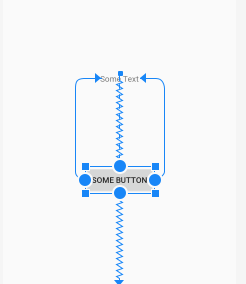

# BAB 2 - ConstraintLayout, Style & Theme


<a href="https://github.com/fahmisbas">
  
</a>
<a href="https://www.linkedin.com/in/fahmisbas/">
  
</a>


<br/><br/><br/><br/>

## Tujuan
Pada bab ini kalian akan memahamai penggunaan ConstraintLayout yaitu salah satu layout terbaru dari Android Studio. Dan juga Style & Theme untuk mempermudah pembuatan layout aplikasi.

## Teori
### ConstraintLayout
ConstraintLayout merupakan sebuah layout yang banyak digunakan oleh pengembang aplikasi Android karena memiliki beberapa kelebihan, salah satunya adalah dapat mengatur View secara flexible tanpa memerlukan _nested layout_ (Kelompok tampilan bertingkat) sehingga tercipta hierarki tampilan datar.

Contoh _nested layout_ :
```xml
<LinearLayout>
    <LinearLayout>
        <TextView/>
        <EditText/>
    </LinearLayout>
    <LinearLayout>
        <TextView/>
        <EditText/>
    </LinearLayout>
    <LinearLayout>
        <TextView/>
        <EditText/>
    </LinearLayout>
</LinearLayout>
```
Contoh hirearki datar menggunakan ConstraintLayout :
```xml
<androidx.constraintlayout.widget.ConstraintLayout>
    <TextView/>
    <EditText/>
    <TextView/>
    <EditText/> 
    <TextView/>
    <EditText/>
</androidx.constraintlayout.widget.ConstraintLayout>
```

Dengan ConstraintLayout kita dapat mengatur layout menggunakan _Visual Layout Editor_ dengan lebih mudah. Hanya dengan menarik _anchor point_ (Top, Bottom, Left, Right) yang terdapat pada View, lalu dihubungkan dengan Parent atau View lainnya. 

<p align="center">
  
</p>

Yang perlu diperhatikan saat menggunakan ConstraintLayout adalah, _achor point_ yang terdapat pada View baik vertikal maupun horizontal harus terhubung dengan anchor point yang dimiliki View lainnya ataupun sisi dari Parent.

<p align="center">
  
</p>

Salah satu kelebihan menggunakan _Visual Layout Editor_ adalah, kode yg dibutuhkan `layout.xml` akan otomatis di-generate oleh Android Studio, sehingga tidak menjadi masalah apabila tidak ingin membuat layout di dalam _Code Editor_. ConstraintLayout juga dapat membuat tampilan UI pada aplikasi menjadi responsif (Cocok untuk bermacam macam ukuran device).

### Style
Saat membangun sebuah layout terkadang kita menemukan View yang memiliki atribut sama dengan View lain nya, yang dibuat dengan cara duplikasi. Hal tersebut tidaklah efisien dan memperbesar kode sehingga akan sulit untuk melakukan perubahan. Contoh nya adalah seperti ini :

`activity_main.xml`
```xml
<TextView
   android:id="@+id/title_1"
   android:layout_width="wrap_content"
   android:layout_height="wrap_content"
   android:layout_margin="10dp"
   android:text="Title 1"
   android:textAppearance="@style/TextAppearance.AppCompat.Title"
   android:textColor="#000000"
   app:layout_constraintStart_toStartOf="parent"
   app:layout_constraintTop_toTopOf="parent" />


<TextView
   android:id="@+id/title_2"
   android:layout_width="wrap_content"
   android:layout_height="wrap_content"
   android:layout_margin="10dp"
   android:text="Title 2"
   android:textAppearance="@style/TextAppearance.AppCompat.Title"
   android:textColor="#000000"
   app:layout_constraintStart_toStartOf="parent"
   app:layout_constraintTop_toBottomOf="@id/title_1" />
```

Solusi dari permasalahan tersebut adalah dengan menggunakan `Style`. `Style` dapat mendefinisikan atribut umum yang gunakan oleh View seperti _Font Color, Font Size, Background Color_ dan banyak lagi. Untuk membuat _Style_ baru dapat dilakukan di `res/values/style.xml`. Berikut adalah contoh implementasinya :

`style.xml`
```xml
<style name="TitleText" >
   <item name="android:layout_width">wrap_content</item>
   <item name="android:layout_height">wrap_content</item>
   <item name="android:textColor">#000000</item>
   <item name="android:textAppearance">@style/TextAppearance.AppCompat.Title</item>
</style>
```
`activity_main.xml`
```xml
<TextView
   android:id="@+id/title_1"
   style="@style/TitleText"
   android:text="Title 1"
   app:layout_constraintStart_toStartOf="parent"
   app:layout_constraintTop_toTopOf="parent" />

<TextView
   android:id="@+id/title_2"
   style="@style/TitleText"
   android:text="Title 2"
   app:layout_constraintStart_toStartOf="parent"
   app:layout_constraintTop_toBottomOf="@id/title_1" />
```
_Style_ dapat digunakan oleh satu atau lebih View, sehingga kode akan lebih ringkas dan lebih mudah untuk membuat perubahan tanpa harus melakukan nya secara manual.

### Theme
Theme adalah jenis _Style_ yang diterapkan pada Activity dan Application. Saat kita menerapkan _Style_ sebagai _Theme_, maka seluruh View pada Activity akan menerapkan setiap atribut _Style_ yang didukungnya. Berikut contoh dari _Theme_.

`style.xml`
```xml
    <style name="AppTheme" parent="Theme.AppCompat.Light.DarkActionBar">
        <item name="colorPrimary">@color/colorPrimary</item>
        <item name="colorPrimaryDark">@color/colorPrimaryDark</item>
        <item name="colorAccent">@color/colorAccent</item>
    </style>
```
Perhatikan kode di atas. Kita menerapkan _Style_ sebagai _Theme_ dengan mendeklarasikan __Theme.AppCompat.Light.DarkActionBar__ sebagai _Parent_ `parent="Theme.AppCompat.Light.DarkActionBar`. Untuk dapat menggunakan _Theme_ kita perlu mendefinisikan nya di dalam berkas `AndroidManifest.xml` di dalam tag `<application>`.

```xml 
android:theme="@style/Theme.LoginScreen" 
```

## Setup Project Baru
Kita akan mengimpementasi teori diatas dengan membangun layout _Login Screen_. Sekarang buka Android Studio dan buat project baru dengan kriteria sebagai berikut.

| Field     | Isian |
| ---      | ---       |
| Nama Project  | **Login Screen**   |
| Target & Minimum Target SDK  | **Phone and Tablet, Api level 21**  |
| Tipe Activity | **Empty Activity** |
| Activity Name | **MainActivity** | 
| Language | **Java** |

## Codelab
1. Buat file baru di dalam __res/values__ dengan cara 
__klik kanan__ pada folder __values__ lalu __-> New -> Values Resource File.__
<p align="left">
  
</p>

2. Beri nama file tersebut __dimens__ lalu tekan tombol OK.
<p align="left">
  
</p>

Kita akan mendefinisikan atribut dimensi di dalam `dimens.xml` yang nantinya akan digunakan oleh _View_, dengan memberinya nama dan nilai di dalam tag `<dimen>`.
Sekarang buka `dimens.xml` dan masukan kode di bawah ini di dalam tag `<resource>`.
```xml
    <dimen name="horizontal_margin">20dp</dimen>
    <dimen name="vertical_margin">20dp</dimen>

    <dimen name="app_icon_large">150dp</dimen>
    <dimen name="app_icon_default">100dp</dimen>
    <dimen name="app_icon_small">50dp</dimen>

    <dimen name="editText_width_default">250dp</dimen>

    <dimen name="button_width_large">200dp</dimen>
    <dimen name="button_width_default">150dp</dimen>
    <dimen name="button_width_small">100dp</dimen>
```

3. Buka __string.xml__ dan masukan kode di bawah ini.
 ```xml
<string name="hint_email">E-mail</string>
<string name="hint_password">Password</string>

<string name="signIn">Sign In</string>
<string name="signUp">Sign Up</string>
```

4. Sekarang tambahkan atribut warna di dalam __colors.xml__
```xml
<color name="colorGreen">#a4c639</color>
<color name="colorWhite">#ffffff</color>
<color name="colorBlue">#0000ff</color>
<color name="colorBlack">#000000</color>
```

5. Buka `theme.xml` dan masukan beberapa style beserta atributnya sebagai berikut.
```xml
<style name="LoginTextField" parent="Widget.AppCompat.EditText">
   <item name="android:layout_width">@dimen/editText_width_default</item>
   <item name="android:layout_height">wrap_content</item>
   <item name="android:textColor">@color/colorBlack</item>
</style>

<style name="LoginButton" parent="Widget.AppCompat.Button">
   <item name="android:layout_width">@dimen/button_width_default</item>
   <item name="android:layout_height">wrap_content</item>
   <item name="android:textColor">@color/colorWhite</item>
   <item name="android:backgroundTint">@color/colorGreen</item>
</style>

<style name="LoginButton.small">
   <item name="android:layout_width">@dimen/button_width_small</item>
</style>

<style name="LoginButton.large">
   <item name="android:layout_width">@dimen/button_width_large</item>
</style>
```
Perhatikan penggunaan _dimens_ dan _colors_. _dimens_ digunakan untuk mendefinisikan ukuran sedangkan sedangkan _colors_ untuk mendefinisikan warna. 

Jika ingin memiliki atribut pada View tertentu, dalam hal ini Button maka kita perlu mewariskan __Widget.AppCompat.Button__ seperti ini `parent="Widget.AppCompat.Button"` letakkan sesudah nama _Style_. 

6. Sekarang, buka __activity_main.xml|__ dan ganti dengan kode di bawah ini.
```xml
<?xml version="1.0" encoding="utf-8"?>
<androidx.constraintlayout.widget.ConstraintLayout xmlns:android="http://schemas.android.com/apk/res/android"
    xmlns:app="http://schemas.android.com/apk/res-auto"
    xmlns:tools="http://schemas.android.com/tools"
    android:layout_width="match_parent"
    android:layout_height="match_parent"
    tools:context=".MainActivity">

    <ImageView
        android:id="@+id/img_appIcon"
        android:layout_width="@dimen/app_icon_large"
        android:layout_height="@dimen/app_icon_large"
        android:layout_marginTop="@dimen/vertical_margin"
        android:src="@mipmap/ic_launcher"
        app:layout_constraintEnd_toEndOf="parent"
        app:layout_constraintStart_toStartOf="parent"
        app:layout_constraintTop_toTopOf="parent" />

    <EditText
        android:id="@+id/edt_email"
        style="@style/LoginTextField"
        android:layout_marginTop="@dimen/vertical_margin"
        android:hint="@string/hint_email"
        app:layout_constraintEnd_toEndOf="parent"
        app:layout_constraintStart_toStartOf="parent"
        app:layout_constraintTop_toBottomOf="@id/img_appIcon" />

    <EditText
        android:id="@+id/edt_password"
        style="@style/LoginTextField"
        android:layout_marginTop="@dimen/vertical_margin"
        android:hint="@string/hint_password"
        app:layout_constraintEnd_toEndOf="parent"
        app:layout_constraintStart_toStartOf="parent"
        app:layout_constraintTop_toBottomOf="@id/edt_email" />


    <Button
        android:id="@+id/btn_login"
        style="@style/LoginButton"
        android:layout_margin="@dimen/vertical_margin"
        android:text="@string/signIn"
        app:layout_constraintBottom_toTopOf="@id/btn_signUp"
        app:layout_constraintEnd_toEndOf="parent"
        app:layout_constraintStart_toStartOf="parent"
        app:layout_constraintTop_toBottomOf="@id/edt_password" />

    <Button
        android:id="@+id/btn_signUp"
        style="@style/LoginButton"
        android:layout_marginTop="@dimen/vertical_margin"
        android:text="@string/signUp"
        app:layout_constraintEnd_toEndOf="@id/btn_login"
        app:layout_constraintStart_toStartOf="@id/btn_login"
        app:layout_constraintTop_toBottomOf="@id/btn_login" />

</androidx.constraintlayout.widget.ConstraintLayout>
```
Maka tampilan nya akan seperti ini.
<p align="center">
  
</p>

_*Penjelasan lebih lanjut mengenai ConstraintLayout dan penggunaan Visual Layout Editor akan dilakukan pada saat praktikum_.

Perhatikan penggunaan _Style_ di dalam `activity_main.xml`. Kita dapat memanggil _Style_ dan menggunakan atribut yang dimilikinya untuk lebih dari satu View. 
Apabila kita mengubah atau menambah nilai atribut _Style_, maka View yg menggunakan _Style_ tersebut akan ikut menyesuaikan.

7. Sekarang Buka `style.xml`, Kita akan menambahkan atribut baru di dalam _Theme_.

Berikut adalah _Theme_ yang dibuat oleh Android Studio secara otomatis saat kita membuat project baru.
```xml
    <style name="Theme.LoginScreen" parent="Theme.MaterialComponents.DayNight.DarkActionBar">
    <!-- Primary brand color. -->
    <item name="colorPrimary">@color/purple_500</item>
    <item name="colorPrimaryVariant">@color/purple_700</item>
    <item name="colorOnPrimary">@color/white</item>
    <item name="colorSecondaryVariant">@color/teal_700</item>
    <item name="colorOnSecondary">@color/black</item>
    <!-- Status bar color. -->
    <item name="android:statusBarColor" tools:targetApi="l">?attr/colorPrimaryVariant</item>
    <!-- Customize your theme here. -->
    </style>
```

Sekarang kita akan menambahkan atribut baru di dalam _Theme_ tersebut, yaitu `android:windowBackground` yang berfungsi untuk memberikan warna background pada Activity.
sehingga  `Theme.LoginScreen` akan terlihat seperti ini : 
```xml
    <style name="Theme.LoginScreen" parent="Theme.MaterialComponents.DayNight.DarkActionBar">
    <!-- Primary brand color. -->
    <item name="colorPrimary">@color/purple_500</item>
    <item name="colorPrimaryVariant">@color/purple_700</item>
    <item name="colorOnPrimary">@color/white</item>
    <item name="colorSecondaryVariant">@color/teal_700</item>
    <item name="colorOnSecondary">@color/black</item>
    <!-- Status bar color. -->
    <item name="android:statusBarColor" tools:targetApi="l">?attr/colorPrimaryVariant</item>
    <!-- Customize your theme here. -->
    <item name="android:windowBackground">@color/colorAccent</item>
    </style>

```
Selanjutnya kita perlu memastikan bahwa `Theme.LoginScreen` sudah didefinisikan di dalam `AndroidManifest.xml`.

```xml
<?xml version="1.0" encoding="utf-8"?>
<manifest xmlns:android="http://schemas.android.com/apk/res/android"
    package="com.acsl.loginscreen">

    <application
        android:allowBackup="true"
        android:icon="@mipmap/ic_launcher"
        android:label="@string/app_name"
        android:roundIcon="@mipmap/ic_launcher_round"
        android:supportsRtl="true"
        android:theme="@style/Theme.LoginScreen">
        <activity android:name=".MainActivity">
            <intent-filter>
                <action android:name="android.intent.action.MAIN" />

                <category android:name="android.intent.category.LAUNCHER" />
            </intent-filter>
        </activity>
    </application>

</manifest>
```

Background pada _Activity_ akan berubah menjadi warna yang digunakan colorAccent.

<p align="center">
  
</p>


##LP
1. Jelaskan apa yang disebut dengan RecyclerView!
2. Jelaskan kegunaan dari LayoutManager!
3. Jelaskan kegunaan dari Adapter pada RecyclerView!
4. Sebutkan pustaka pihak ketiga (Third Party Library) yang dapat digunakan untuk memuat gambar yang berasal dari internet! 

##LA
1. Jelaskan secara ringkas mengenai materi yang sudah di ajarkan!


