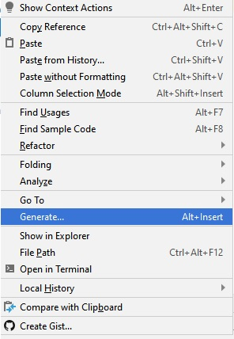
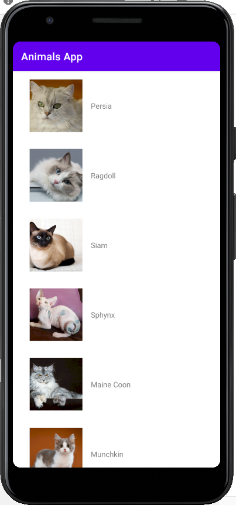

# BAB 3 RecyclerView & OnItemClick


<a href="https://github.com/fahmisbas">
  
</a>
<a href="https://www.linkedin.com/in/fahmisbas/">
  
</a>


<br/><br/><br/><br/>

## Tujuan
Pada Bab ini kita akan mempelajari cara menampilkan data dalam bentuk List menggunakan RecyclerView, kemudian menerima dan memproses _click event_  pada setiap item.

## Teori
RecyclerView merupakan sebuah ViewGroup yang digunakan untuk menampilkan koleksi data, baik dalam bentuk List, Grid dan Staggered grid. RecyclerView memiliki performa yang lebih baik dibandingkan pendahulunya yaitu ListView, karena ia hanya akan memuat item yang perlu ditampilkan, sehingga menjadikan nya efisien dalam penggunaan memori. 

<p align="center">
  
</p>

Dalam implementasi nya, RecylerView membutuhkan `LayoutManager` untuk mengatur bagaimana koleksi data ditampilkan. Kita dapat menggunakan `LinearLayoutManager` untuk menampilkan data dalam bentuk List secara Vertikal atau Horizontal dan `GridLayoutManager` untuk menampilkan data dalam bentuk Grid. Sumber data yang ditampilkan dapat berupa Array, List, dan Map. 

<p align="center">
  
</p>

RecyclerView membutuhkan objek Adapter untuk dapat bekerja. Adapter digunakan untuk memuat tampilan Item pada List. 
## Setup Project Baru
Kita akan mengimplementasi teori di atas dengan membuat Aplikasi yang berisikan list gambar dan nama-nama Ras Kucing.

| Field     | Isian |
| ---      | ---       |
| Nama Project  | **Cat Breeds App**   |
| Target & Minimum Target SDK  | **Phone and Tablet, Api level 21**  |
| Tipe Activity | **Empty Activity** |
| Activity Name | **MainActivity** | 
| Language | **Java** |

## Codelab
1. Untuk dapat menggunakan RecyclerView, kita perlu menambahkan Library __RecyclerView AndroidX__ di dalam project kita dengan menambahkan dependency di dalam __app/build.gradle(Module.app)__.
```gradle
dependencies {
   ...
   
   //RecyclerView
   implementation "androidx.recyclerview:recyclerview:1.1.0"
}
```
2. Karena gambar yang akan ditampilkan kedalam List berasal dari internet, kita perlu menggunakan library pihak ketiga untuk dapat men-download dan menampilkan gambar tersebut. Library yang kita gunakan adalah Glide. 

Tambahkan Glide ke dalam __app/build.gradle(Module.app)__ di dalam blok `dependencies`.
```gradle
dependencies {
   ...

   //Image Loader
   implementation 'com.github.bumptech.glide:glide:4.11.0'
}
```
Sehingga block `dependecies` akan terlihat seperti ini.
```gradle
...

dependencies {
   implementation fileTree(dir: 'libs', include: ['*.jar'])

   implementation 'androidx.appcompat:appcompat:1.1.0'
   implementation 'androidx.constraintlayout:constraintlayout:1.1.3'

   //RecyclerView
   implementation "androidx.recyclerview:recyclerview:1.1.0"
   //Image Loader
   implementation 'com.github.bumptech.glide:glide:4.11.0'


   testImplementation 'junit:junit:4.12'
   androidTestImplementation 'androidx.test.ext:junit:1.1.1'
   androidTestImplementation 'androidx.test.espresso:espresso-core:3.2.0'
}
```
Selanjutnya lakukan __Sync Now__.

<p align="left">
  
</p>

Apabila terjadi error pastikan tidak terdapat salah ketik.


3. Buka `activity_main.xml` dan kondisikan seperti yang ada di bawah ini.
```xml
<?xml version="1.0" encoding="utf-8"?>
<LinearLayout xmlns:android="http://schemas.android.com/apk/res/android"
    xmlns:app="http://schemas.android.com/apk/res-auto"
    xmlns:tools="http://schemas.android.com/tools"
    android:layout_width="match_parent"
    android:layout_height="match_parent"
    android:orientation="vertical"
    tools:context=".MainActivity">

    <androidx.recyclerview.widget.RecyclerView
        android:id="@+id/rv_cat_breeds"
        android:layout_width="match_parent"
        android:layout_height="wrap_content"/>

</LinearLayout>
```
4.  Selanjutnya kita perlu membuat layout yang nantinya digunakan pada setiap item pada list.
Buat layout baru di dalam __res/layout__ dan beri nama `item_cat_breed.xml`.
Kondisikan layoutnya seperti di bawah ini.
```xml 
<?xml version="1.0" encoding="utf-8"?>
<androidx.constraintlayout.widget.ConstraintLayout xmlns:android="http://schemas.android.com/apk/res/android"
    xmlns:app="http://schemas.android.com/apk/res-auto"
    xmlns:tools="http://schemas.android.com/tools"
    android:layout_width="match_parent"
    android:layout_height="wrap_content"
    android:padding="16dp">

    <ImageView
        android:id="@+id/img_cat"
        android:layout_width="100dp"
        android:layout_height="100dp"
        android:layout_marginStart="16dp"
        android:layout_marginEnd="16dp"
        android:scaleType="centerCrop"
        app:layout_constraintStart_toStartOf="parent"
        app:layout_constraintTop_toTopOf="parent"
        tools:src="@android:color/darker_gray"/>

    <TextView
        android:id="@+id/tv_breed_name"
        android:layout_width="wrap_content"
        android:layout_height="wrap_content"
        android:layout_marginStart="16dp"
        app:layout_constraintBottom_toBottomOf="@id/img_cat"
        app:layout_constraintStart_toEndOf="@id/img_cat"
        app:layout_constraintTop_toTopOf="@id/img_cat"
        tools:text="Breed" />

</androidx.constraintlayout.widget.ConstraintLayout>
```
5. Berikutnya buat `Class Model` dengan nama `CatBreedModel` dengan cara __klik kanan pada nama Package -> New -> Java Class__
<p align="left">
  
</p>

Setelah itu deklarasikan variabel baru sebagai berikut :
```java
public class CatBreedModel {

    private String imageUrl;
    private String breedName;
    
}

```
Buat __Constructor__ untuk meng inisialisasi variabel.
```java
...
public class CatBreedModel {
    
    private String imageUrl;
    private String breedName;

    CatBreedModel(String breedName, String imageUrl) {
        this.imageUrl = imageUrl;
        this.breedName = breedName;
    }
}
```
Buat Getter dengan cara __klik kanan__ di dalam `CatBreedModel` kemudian __Generate -> Getter__.

<p align="left">
  
</p>

Pilih variabel yang telah dibuat.

<p align="left">
  
</p>
Tekan tombol OK.

Sehingga kode pada `CatBreedModel` menjadi seperti ini.
```java
public class CatBreedModel {

    private String imageUrl;
    private String breedName;

    CatBreedModel(String breedName, String imageUrl) {
        this.imageUrl = imageUrl;
        this.breedName = breedName;
    }

    public String getImageUrl() {
        return imageUrl;
    }

    public String getBreedName() {
        return breedName;
    }
}
```
6. Berikutnya kita perlu menambahkan Class yang berisikan koleksi data.
Buat Class baru dan beri nama  `CatBreedData`.
<p align="left">
  
</p>

Kondisikan Class tersebut seperti di bawah ini.
```java
public class CatBreedData {

    private static ArrayList<CatBreedModel> catBreeds = new ArrayList<>();

    public static ArrayList<CatBreedModel> getCatBreeds() {
        catBreeds.add(new CatBreedModel("Persia","https://raw.githubusercontent.com/Fahmisbas/acsl-mcs/master/Bab%203%20-%20RecyclerView%20%26%20OnItemClickListener/cats/persia.jpg"));
        catBreeds.add(new CatBreedModel("Ragdoll","https://raw.githubusercontent.com/Fahmisbas/acsl-mcs/master/Bab%203%20-%20RecyclerView%20%26%20OnItemClickListener/cats/ragdoll.png"));
        catBreeds.add(new CatBreedModel("Siam","https://raw.githubusercontent.com/Fahmisbas/acsl-mcs/master/Bab%203%20-%20RecyclerView%20%26%20OnItemClickListener/cats/siam.jpeg"));
        catBreeds.add(new CatBreedModel("Sphynx","https://raw.githubusercontent.com/Fahmisbas/acsl-mcs/master/Bab%203%20-%20RecyclerView%20%26%20OnItemClickListener/cats/sphynx.jpg"));
        catBreeds.add(new CatBreedModel("Maine Coon","https://raw.githubusercontent.com/Fahmisbas/acsl-mcs/master/Bab%203%20-%20RecyclerView%20%26%20OnItemClickListener/cats/maine%20coon.jpg"));
        catBreeds.add(new CatBreedModel("Munchkin","https://raw.githubusercontent.com/Fahmisbas/acsl-mcs/master/Bab%203%20-%20RecyclerView%20%26%20OnItemClickListener/cats/munchkin.jpg"));
        catBreeds.add(new CatBreedModel("Bengal","https://raw.githubusercontent.com/Fahmisbas/acsl-mcs/master/Bab%203%20-%20RecyclerView%20%26%20OnItemClickListener/cats/bengal.png"));
        catBreeds.add(new CatBreedModel("Britain Shorthair","https://raw.githubusercontent.com/Fahmisbas/acsl-mcs/master/Bab%203%20-%20RecyclerView%20%26%20OnItemClickListener/cats/britain%20shorthair.jpg"));

        return catBreeds;
    }
}
```
7. Berikutnya kita perlu membuat __Adapter RecyclerView__. Buat kelas baru dengan nama `CatBreedAdapter`.
<p align="left">
  
</p>

Kemudian extends `RecyclerView.Adapter` seperti berikut.
```java
...

public class CatBreedAdapter extends RecyclerView.Adapter<CatBreedAdapter.ViewHolder> {

}
```
Akan muncul _underline_ berwarna merah. Tekan __Alt+Enter__ pada `RecyclerView.Adapter`, lalu __Implement methods__.
<p align="left">
  
</p>

Pilih seluruh Method yang dimiliki `RecyclerView.Adapter` lalu tekan tombol OK.
<p align="left">
  
</p>

Sehingga `CatBreedAdapter` akan terlihat seperti ini.
```java
...

public class CatBreedAdapter extends RecyclerView.Adapter<CatBreedAdapter.ViewHolder> {

    @NonNull
    @Override
    public CatBreedAdapter.ViewHolder onCreateViewHolder(@NonNull  ViewGroup parent, int viewType) {
        return null;
    }

    @Override
    public void onBindViewHolder(@NonNull CatBreedAdapter.ViewHolder holder, int position) {

    }

    @Override
    public int getItemCount() {
        return 0;
    }
}
```

8. Sekarang kita membutuhkan `ViewHolder` untuk menampung View yang terdapat pada layout `item_cat_breed.xml`. Tekan __Alt+Enter__ pada `ViewHolder` untuk membuat Class tersebut.
<p align="left">
  
</p>

Berikutnya extends `RecyclerView.ViewHolder` pada Class `ViewHolder` lalu buat Constructor-nya dengan cara, tekan __Alt+Enter__ pada class tersebut lalu pilih _Create constructor matching super_.
<p align="left">
  
</p>

Maka Class `ViewHolder` akan terlihat seperti ini.
```java
public class ViewHolder extends RecyclerView.ViewHolder  {
   public ViewHolder(@NonNull View itemView) {
       super(itemView);
   }
}
```

Kita perlu menginisialisasi `View` yang terdapat pada `item_cat_breed.xml` di dalam class `ViewHolder` sehingga menjadi seperti ini.
```java
public class CatBreedAdapter extends RecyclerView.Adapter<CatBreedAdapter.ViewHolder> {

    ...

    public class ViewHolder extends RecyclerView.ViewHolder {
        ImageView imgCat;
        TextView tvBreedName;

        public ViewHolder(@NonNull View itemView) {
            super(itemView);
            imgCat = itemView.findViewById(R.id.img_cat);
            tvBreedName = itemView.findViewById(R.id.tv_breed_name);
        }
    }
}
```

9. Selanjutnya buat sebuah ArrayList dan Constructor untuk menerima koleksi data.
```java
public class CatBreedAdapter extends RecyclerView.Adapter<CatBreedAdapter.ViewHolder> {

    private ArrayList<CatBreedModel> catBreeds = new ArrayList<>();

    public CatBreedAdapter(ArrayList<CatBreedModel> catBreeds) {
        this.catBreeds.clear();
        this.catBreeds.addAll(catBreeds);
        notifyDataSetChanged();
    }

    ...

}
```
10. Sekarang masukan kode berikut di dalam Method `onCreateViewHolder()`.
```java
public class CatBreedAdapter extends RecyclerView.Adapter<CatBreedAdapter.ViewHolder> {

   ...

    @NonNull
    @Override
    public CatBreedAdapter.ViewHolder onCreateViewHolder(@NonNull  ViewGroup parent, int viewType) {
        View view = LayoutInflater.from(parent.getContext()).inflate(R.layout.item_cat_breed, parent, false);
        return new ViewHolder(view);
    }

   ...
}
```

Agar dapat menampilkan item pada RecyclerView, kita perlu menggunakan `LayoutInflater` yang di _assign_  ke dalam `View`.
Lalu objek tersebut digunakan oleh `ViewHolder` untuk melakukan _casting_ view dengan `findViewById()`.

11. Selanjutnya kita perlu menampilkan data di dalam `onBindViewHolder()` dengan menambah kode berikut.
```java
public class CatBreedAdapter extends RecyclerView.Adapter<CatBreedAdapter.ViewHolder> {

   ...

    @Override
    public void onBindViewHolder(@NonNull CatBreedAdapter.ViewHolder holder, int position) {
        CatBreedModel catBreed = catBreeds.get(position);

        Glide.with(holder.itemView.getContext())
                .load(catBreed.getImageUrl())
                .into(holder.imgCat);
                
        holder.tvBreedName.setText(catBreed.getBreedName())
    }
    
   ...
}
```

12. Sekarang tambahkan kode berikut di dalam `getItemCount()`.
```java
public class CatBreedAdapter extends RecyclerView.Adapter<CatBreedAdapter.ViewHolder> {

   ...
    
   @Override
   public int getItemCount() {
        return catBreeds.size();
   }
   
   ...
}
```
Method tersebut digunakan untuk menentukan berapa banyak item yang perlu ditampilkan di dalam RecyclerView. 

Sehingga `CatBreedAdapter` akan terlihat seperti ini.
```java
public class CatBreedAdapter extends RecyclerView.Adapter<CatBreedAdapter.ViewHolder> {

    private ArrayList<CatBreedModel> catBreeds = new ArrayList<>();

    public CatBreedAdapter(ArrayList<CatBreedModel> catBreeds) {
        this.catBreeds.clear();
        this.catBreeds.addAll(catBreeds);
        notifyDataSetChanged();
    }

    @NonNull
    @Override
    public CatBreedAdapter.ViewHolder onCreateViewHolder(@NonNull  ViewGroup parent, int viewType) {
        View view = LayoutInflater.from(parent.getContext()).inflate(R.layout.item_cat_breed, parent, false);
        return new ViewHolder(view);
    }

    @Override
    public void onBindViewHolder(@NonNull CatBreedAdapter.ViewHolder holder, int position) {
        CatBreedModel catBreed = catBreeds.get(position);

        Glide.with(holder.itemView.getContext())
                .load(catBreed.getImageUrl())
                .into(holder.imgCat);
    }

    @Override
    public int getItemCount() {
        return catBreeds.size();
    }

    public class ViewHolder extends RecyclerView.ViewHolder {
        ImageView imgCat;
        TextView tvBreedName;

        public ViewHolder(@NonNull View itemView) {
            super(itemView);
            imgCat = itemView.findViewById(R.id.img_cat);
            tvBreedName = itemView.findViewById(R.id.tv_breed_name);
        }
    }
}
```

13. Sekarang buka `MainActivity`, lakukan inisialisasi RecyclerView dan ambil data yang berasal dari `CatBreedData` untuk digunakan oleh Adapter.
```java
public class MainActivity extends AppCompatActivity {

    private RecyclerView rvCatBreed;
    private ArrayList<CatBreedModel> catBreeds = new ArrayList<>();

    @Override
    protected void onCreate(Bundle savedInstanceState) {
        super.onCreate(savedInstanceState);
        setContentView(R.layout.activity_main);

        rvCatBreed = findViewById(R.id.rv_cat_breed);

        catBreeds.addAll(CatBreedData.getCatBreeds());

        initRecyclerView();

    }

    private void initRecyclerView() {
        CatBreedAdapter adapter = new CatBreedAdapter(catBreeds);
        rvCatBreed.setLayoutManager(new LinearLayoutManager(this));
        rvCatBreed.setAdapter(adapter);
    }
}
```
Perhatikan kode di dalam `initRecyclerView()`. Kita membuat objek Adapter dan memberikan koleksi data ke dalam Constructor-nya. RecyclerView yang telah diinisialisasi diatur tampilan nya menggunakan `LinearLayoutManager` agar menampilkan data dalam bentuk list secara vertikal. Kemudian RecyclerView tersebut memanggil `setAdapter()` dan memasukan objek Adapter yang telah dibuat.

14. Sebelum kita menjalankan programnya, kita perlu membuat permintaan kepada sistem Android untuk menggunakan internet, karena gambar yang akan kita tampilkan berasal dari internet. Permintaan tersebut dapat dilakukan di dalam berkas `AndroidManifest.xml`.

Sekarang buka `AndroidManifest.xml`, tambahkan permintaan di bawah ini. Letakkan di dalam tag `<manifest>` dan di luar tag  `<application>`.

```xml
    <uses-permission android:name="android.permission.INTERNET"/>
```

Sehingga `AndroidManifest.xml` akan terlihat seperti ini.
```xml
<?xml version="1.0" encoding="utf-8"?>
<manifest xmlns:android="http://schemas.android.com/apk/res/android"
    package="com.acsl.animalsapp">

    <!-- Meminta akses Internet.-->
    <uses-permission android:name="android.permission.INTERNET"/>

    <application
        android:allowBackup="true"
        android:icon="@mipmap/ic_launcher"
        android:label="@string/app_name"
        android:roundIcon="@mipmap/ic_launcher_round"
        android:supportsRtl="true"
        android:theme="@style/AppTheme">
        <activity android:name=".MainActivity">
            <intent-filter>
                <action android:name="android.intent.action.MAIN" />

                <category android:name="android.intent.category.LAUNCHER" />
            </intent-filter>
        </activity>
    </application>

</manifest>
```

Sekarang jalankan programnya, maka tampilan nya akan seperti ini.

<p align="left">
  
</p>

15. Kita sudah berhasil membuat Aplikasi yang berisikan daftar gambar dan nama-nama ras kucing.
Sekarang  tinggal menambahkankan kode untuk mendeteksi dan memproses klik pada item di list.

Buka kembali `CatBreedAdapter` dan tambahkan sebuah `interface` di dalamnya.
```java

...
public class CatBreedAdapter extends RecyclerView.Adapter<CatBreedAdapter.ViewHolder> {

    ...

    interface OnItemClickListener {
        void onItemClicked(String name);
    }
}

...
```

16. Deklarasikan variabel dari Interface tersebut.
```java
public class CatBreedAdapter extends RecyclerView.Adapter<CatBreedAdapter.ViewHolder> {

    
    private OnItemClickListener onItemClickListener;

    
    ...

    interface OnItemClickListener {
        void onItemClicked(String name);
    }
}
```

Kemudian buatkan Method Setter. 
```java
public class CatBreedAdapter extends RecyclerView.Adapter<CatBreedAdapter.ViewHolder> {

    
    private OnItemClickListener onItemClickListener;

    
    ...
    
    public void setOnItemClickListener(OnItemClickListener onItemClickListener) {
        this.onItemClickListener = onItemClickListener;
    }

    ...
    
    interface OnItemClickListener {
        void onItemClicked(String name);
    }
}
```

Selanjutnya masukan kode berikut di dalam Method `onBindViewHolder()`.
```java
public class CatBreedAdapter extends RecyclerView.Adapter<CatBreedAdapter.ViewHolder> {


    private OnItemClickListener onItemClickListener;

    ...
    
    
    public void setOnItemClickListener(OnItemClickListener onItemClickListener) {
        this.onItemClickListener = onItemClickListener;
    }


    @Override
    public void onBindViewHolder(@NonNull CatBreedAdapter.ViewHolder holder, int position) {
        
        ...

        holder.itemView.setOnClickListener(new View.OnClickListener() {
            @Override
            public void onClick(View v) {
                onItemClickListener.onItemClicked(catBreed.getBreedName());
            }
        });
    }

    ...
    
    interface OnItemClickListener {
        void onItemClicked(String name);
    }
}
```
17. Kita sudah berhasil membuat Interface. Sekarang kembali ke __MainActivity__ dan tambahkan kode berikut di dalam Method `initRecyclerView()`.

```java
public class MainActivity extends AppCompatActivity {
    ...

    private void initRecyclerView() {
        CatBreedAdapter adapter = new CatBreedAdapter(catBreeds);
        rvCatBreed.setLayoutManager(new LinearLayoutManager(this));
        rvCatBreed.setAdapter(adapter);

        adapter.setOnItemClickListener(new CatBreedAdapter.OnItemClickListener() {
            @Override
            public void onItemClicked(String name) {
                Toast.makeText(getApplicationContext(),name, Toast.LENGTH_SHORT).show();
            }
        });
    }
}
```

Kita mengggunakan Interface tersebut agar respon klik yang kita terima dapat diproses di dalam `MainActivity`. Sekarang jalankan kembali programnya, apabila item pada list ditekan, Aplikasi akan memunculkan pesan `Toast` yang  menampilkan nama perangkat ras kucing yang ditekan.

## LP
1. Jelaskan apa itu SharedPreference!
2. Apa yang dimaksud dengan data persistent?
3. Pada kasus apa SharedPreference digunakan?
4. Apa yang dimaksud dengan data primitif!

## LA
1. Jelaskan secara ringkas mengenai materi yang sudah diajarkan!


