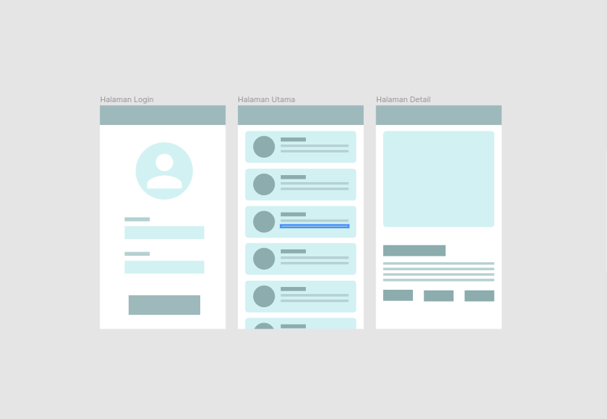

# BAB 4 - Weekly Submission Aplikasi Sederhana

    

## Detail Submission
Sampai tahap ini kita sudah mempelajari : 
* Activity
* ConstraintLayout
* RecyclerView 

Maka pada Bab 4, anda diwajibkan untuk membuat submission berupa aplikasi dengan syarat sebagai berikut : 
* Terdapat Halaman Login dengan username dan password tertanam didalamnya. Username menggunakan NPM dan password menggunakan TTL praktikan dengan format (ddmmyyyy). Sebagai contoh apabila anda lahir pada tanggal 10 Juli 1998 maka password yang harus diset pada halaman login aplikasi adalah sebagai berikut : 10071998.
* Terdapat Halaman Utama berisikan daftar konten yang tersedia pada aplikasi. Tema yang dipilih bebas dan harus dengan persetujuan PJ praktikum. Penerapan daftar konten wajib menggunakan RecyclerView yang sudah di pelajari pada Bab 3. 
* Terdapat Halaman Detail berisikan detail konten yang dipilih pada Halaman Utama. Konten yang ditampilkan pada halaman detail wajib relevan dengan item yang dipilih pada Halaman Utama.
* Seluruh *layout* wajib diterapkan dengan ConstraintLayout yang sudah dipelajari pada Bab 2. 

## Pengiriman Submission
* File ZIP hasil ekspor aplikasi dikirimkan ke alamat email masing-masing PJ shift dengan subjek email MCSPM_NAMA_NPM_NAMAAPLIKASI. 
* Submission harus dikirimkan pada durasi minggu submission tersebut. Submission akan direspon oleh PJ hingga hari Jum'at pukul 23.59 WIB. Submission yang tidak memenuhi syarat diatas akan ditolak oleh PJ dan praktikan wajib mengirim ulang submission yang sudah memenuhi syarat. 
* Apabila sampai pada hari Jum'at 23.59 WIB status submission praktikan adalah ditolak atau praktikan tidak mengirimkan submssion pada rentang waktu yang ditentukan maka nilai minggu submission praktikan adalah 0.
* Perlu diperhatikan bahwa poin nilai submission sangat mempengaruhi nilai akhir praktikan.

## (Alternatif) Submission Berbasis Kerja Tulis
Apabila praktikan mengalami kendala dalam keterbatasan spesifikasi komputer untuk menjalankan proyek MCS, maka praktikan diperbolehkan untuk mengambil opsi Submission Berbasisi Kerja Tulis dengan kriteria sebagai berikut : 

* Menuliskan seluruh baris kode pada Codelabs Bab 1, Bab 2, dan Bab 3, serta menjelaskan per setiap baris kode yang ada. Praktikan harus menuliskan kode yang sudah terbentuk secara menyeluruh, bukan perbagian-bagian.
* Submission yang dikerjakan harus sesuai dengan persyaratan yang ada pada SOP (dapat dilihat pada bagian Proyek Berbasis Kerja Tulis)
* Submission harus dikirimkan pada durasi minggu submission tersebut. Submission akan direspon oleh PJ hingga hari Jum'at pukul 23.59 WIB. Submission yang tidak memenuhi syarat diatas akan ditolak oleh PJ dan praktikan wajib mengirim ulang submission yang sudah memenuhi syarat. 
