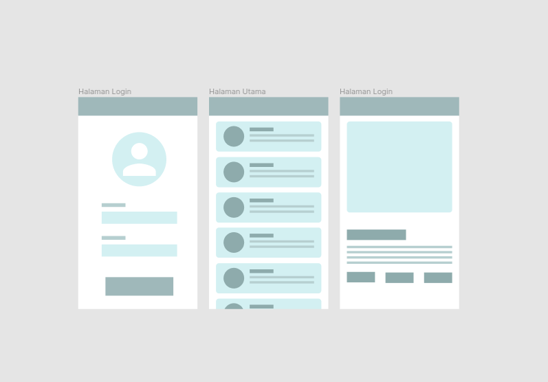

# BAB 4 - Weekly Submission Aplikasi Sederhana

    

## Detail Submission
Sampai tahap ini kita sudah mempelajari : 
* Activity
* ConstraintLayout
* RecyclerView 

Maka pada Bab 4, anda diwajibkan untuk membuat submissi berupa aplikasi dengan syarat sebagai berikut : 
* Terdapat Halaman Login dengan username dan password tertanam didalamnya. Username menggunakan NPM dan password menggunakan TTL praktikan dengan format (ddmmyyyy). Sebagai contoh apabila anda lahir pada tanggal 10 Juli 1998 maka password yang harus diset pada halaman login aplikasi adalah sebagai berikut : 10071998.
* Terdapat Halaman Utama berisikan daftar konten yang tersedia pada aplikasi. Tema yang dipilih bebas dan harus dengan persetujuan PJ praktikum. Penerapan daftar konten wajib menggunakan RecyclerView yang sudah di pelajari pada Bab 3. 
* Terdapat Halaman Detail berisikan detail konten yang dipilih pada Halaman Utama. Konten yang ditampilkan pada halaman detail wajib relevan dengan item yang dipilih pada Halaman Utama.
* Seluruh *layout* wajib diterapkan dengan ConstraintLayout yang sudah dipelajari pada Bab 2. 

## Format Pengiriman
Aplikasi 
