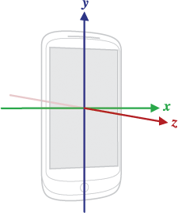
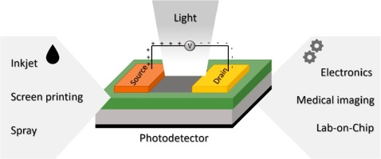
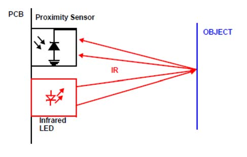
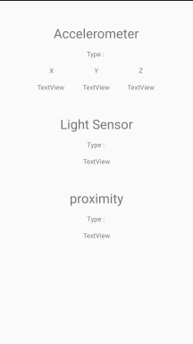

# BAB 5 - Acceleration, Light and Proximity Sensors


<a href="https://github.com/lefalya">
  
</a>
<a href="https://www.linkedin.com/in/berninofalya/">
  
</a>

<br/><br/><br/><br/>

## Tujuan
Pada percobaan bab ini kalian akan memahamai cara mengakses sensor  akselerasi, jarak, serta cahaya yang tertanam pada perangkat Android kalian.

## Teori
### Accelerometer
Accelerometer merupakan perangkat elektromekanikal yang berfungsi untuk mengukur besar gaya percepatan. Gaya percepatan dapat berupa statik seperti gaya percepeatan gravitasi atau hasil pergerakan atau getaran dinamis. Akselerasi merupakan ukuran perubahan kecepatan dibagi oleh waktu. <br />
<p align="center">
  <br />
  *Gambar 1 : Sistem Koordinat Pada Perangkat Android*<br />
</p>

### Sensor Cahaya
Sensor cahaya merupakan perangkat pasif yang mengkonversi energi cahaya menjadi sinyal listrik. Secara umum, sensor cahaya dikenal juga sebagai *photoelectronic devices* atau *photo sensors* dikarenakan sifatnya yang merubah cahaya (*photon*) menjadi listrik (*elektron*).<br />
<p align="center">
<br />
*Gambar 2 : Cara Kerja Sensor Cahaya*<br />
</p>

### Sensor Jarak (*Proximity*)
Sensor jarak merupakan sensor yang dapat mendeteksi keberadaan objek disekitarnya tanpa melakukan kontak fisik. Sensor jarak memancarkan gelombang elektromagnetik inframerah ke objek disekitarnya dan menerima perubahan dari gelombang yang dipancarkannya. <br />
<p align="center">
<br />
*Gambar 3 : Cara Kerja Sensor Jarak (Proximity)*<br />
</p>

## Codelab
1. Buatlah project baru pada Android Studio dengan kriteria sebagai berikut : 

| Field     | Isian |
| ---      | ---       |
| Nama Project  | **Sensors**   |
| Target & Minimum Target SDK  | **Phone and Tablet, API level 21**  |
| Tipe Activity | **Empty Activity** |
| Activity Name | **MainActivity** | 
| Language | **Java** |

2. Ganti keseluruhan kode pada `activity_main.xml` dengan kode berikut : 
```xml
<?xml version="1.0" encoding="utf-8"?>
<androidx.constraintlayout.widget.ConstraintLayout xmlns:android="http://schemas.android.com/apk/res/android"
    xmlns:app="http://schemas.android.com/apk/res-auto"
    xmlns:tools="http://schemas.android.com/tools"
    android:layout_width="match_parent"
    android:layout_height="match_parent"
    tools:context=".MainActivity">

    <TextView
        android:id="@+id/accelerometer"
        android:layout_width="wrap_content"
        android:layout_height="wrap_content"
        android:layout_marginTop="50dp"
        android:text="Accelerometer"
        android:textSize="12pt"
        app:layout_constraintEnd_toEndOf="parent"
        app:layout_constraintHorizontal_bias="0.498"
        app:layout_constraintStart_toStartOf="parent"
        app:layout_constraintTop_toTopOf="parent" />

    <TextView
        android:id="@+id/lightSensor"
        android:layout_width="wrap_content"
        android:layout_height="wrap_content"
        android:layout_marginTop="50dp"
        android:text="Light Sensor"
        android:textSize="12pt"
        app:layout_constraintEnd_toEndOf="parent"
        app:layout_constraintStart_toStartOf="parent"
        app:layout_constraintTop_toBottomOf="@+id/yAccVal" />

    <TextView
        android:id="@+id/proximity"
        android:layout_width="wrap_content"
        android:layout_height="wrap_content"
        android:layout_marginTop="50dp"
        android:text="proximity"
        android:textSize="12pt"
        app:layout_constraintEnd_toEndOf="parent"
        app:layout_constraintStart_toStartOf="parent"
        app:layout_constraintTop_toBottomOf="@+id/lightVal" />

    <TextView
        android:id="@+id/accType"
        android:layout_width="wrap_content"
        android:layout_height="wrap_content"
        android:layout_marginTop="16dp"
        android:text="Type : "
        app:layout_constraintEnd_toEndOf="@+id/accelerometer"
        app:layout_constraintStart_toStartOf="@+id/accelerometer"
        app:layout_constraintTop_toBottomOf="@+id/accelerometer" />

    <TextView
        android:id="@+id/lightType"
        android:layout_width="wrap_content"
        android:layout_height="wrap_content"
        android:layout_marginTop="16dp"
        android:text="Type : "
        app:layout_constraintEnd_toEndOf="@+id/lightSensor"
        app:layout_constraintStart_toStartOf="@+id/lightSensor"
        app:layout_constraintTop_toBottomOf="@+id/lightSensor" />

    <TextView
        android:id="@+id/proxType"
        android:layout_width="wrap_content"
        android:layout_height="wrap_content"
        android:layout_marginTop="16dp"
        android:text="Type : "
        app:layout_constraintEnd_toEndOf="@+id/proximity"
        app:layout_constraintStart_toStartOf="@+id/proximity"
        app:layout_constraintTop_toBottomOf="@+id/proximity" />

    <TextView
        android:id="@+id/textView3"
        android:layout_width="wrap_content"
        android:layout_height="wrap_content"
        android:layout_marginTop="16dp"
        android:text="X"
        app:layout_constraintEnd_toStartOf="@+id/accelerometer"
        app:layout_constraintTop_toBottomOf="@+id/accType" />

    <TextView
        android:id="@+id/textView4"
        android:layout_width="wrap_content"
        android:layout_height="wrap_content"
        android:layout_marginTop="16dp"
        android:text="Y"
        app:layout_constraintEnd_toEndOf="@+id/accType"
        app:layout_constraintStart_toStartOf="@+id/accType"
        app:layout_constraintTop_toBottomOf="@+id/accType" />

    <TextView
        android:id="@+id/textView5"
        android:layout_width="wrap_content"
        android:layout_height="wrap_content"
        android:layout_marginTop="16dp"
        android:text="Z"
        app:layout_constraintStart_toEndOf="@+id/accelerometer"
        app:layout_constraintTop_toBottomOf="@+id/accType" />

    <TextView
        android:id="@+id/xAccVal"
        android:layout_width="61dp"
        android:layout_height="18dp"
        android:layout_marginTop="16dp"
        android:text="TextView"
        app:layout_constraintEnd_toEndOf="@+id/textView3"
        app:layout_constraintStart_toStartOf="@+id/textView3"
        app:layout_constraintTop_toBottomOf="@+id/textView3" />

    <TextView
        android:id="@+id/yAccVal"
        android:layout_width="wrap_content"
        android:layout_height="wrap_content"
        android:layout_marginTop="16dp"
        android:text="TextView"
        app:layout_constraintEnd_toEndOf="@+id/textView4"
        app:layout_constraintStart_toStartOf="@+id/textView4"
        app:layout_constraintTop_toBottomOf="@+id/textView4" />

    <TextView
        android:id="@+id/zAccVal"
        android:layout_width="wrap_content"
        android:layout_height="wrap_content"
        android:layout_marginTop="16dp"
        android:text="TextView"
        app:layout_constraintEnd_toEndOf="@+id/textView5"
        app:layout_constraintStart_toStartOf="@+id/textView5"
        app:layout_constraintTop_toBottomOf="@+id/textView5" />

    <TextView
        android:id="@+id/lightVal"
        android:layout_width="wrap_content"
        android:layout_height="wrap_content"
        android:layout_marginTop="16dp"
        android:text="TextView"
        app:layout_constraintEnd_toEndOf="@+id/lightType"
        app:layout_constraintStart_toStartOf="@+id/lightType"
        app:layout_constraintTop_toBottomOf="@+id/lightType" />

    <TextView
        android:id="@+id/proxVal"
        android:layout_width="wrap_content"
        android:layout_height="wrap_content"
        android:layout_marginTop="16dp"
        android:text="TextView"
        app:layout_constraintEnd_toEndOf="@+id/proxType"
        app:layout_constraintStart_toStartOf="@+id/proxType"
        app:layout_constraintTop_toBottomOf="@+id/proxType" />
</androidx.constraintlayout.widget.ConstraintLayout>
```

Pastikan tampilan layout terlihat seperti pada gambar berikut : <br />

<br />

3. Tambahkan *dependencies* yang dibutuhkan pada kelas MainActivity.java dengan menuliskan baris-baris berikut : 
```java
package com.acsl.NAMA_PACKAGE;

import ...

import android.content.Context;
import android.hardware.Sensor;
import android.hardware.SensorEvent;
import android.hardware.SensorEventListener;
import android.hardware.SensorManager;
import android.os.Bundle;
import android.util.Log;
import android.widget.TextView;

public class MainActivity extends AppCompatActivity {
  
  @Override
  protected void onCreate(Bundle savedInstanceState) {
        super.onCreate(savedInstanceState);
        setContentView(R.layout.activity_main);
  }
}
```

4. Deklarasikan variable yang dibutuhkan dengan menambahkan baris kode berikut : 

```java
package com.acsl.NAMA_PACKAGE;

import ...

public class MainActivity extends AppCompatActivity {
  
  private SensorManager sensorManager;
  private Sensor accSensor;
  private Sensor lightSensor;
  private Sensor proximitySensor;

  private TextView accType;
  private TextView lightType;
  private TextView proxType;
  private TextView xAccVal;
  private TextView yAccVal;
  private TextView zAccVal;
  private TextView proxVal;
  private TextView lightVal;
  
  @Override
  protected void onCreate(Bundle savedInstanceState) {
        super.onCreate(savedInstanceState);
        setContentView(R.layout.activity_main);
  }
}
```
Variable `sensorManager` berfungsi sebagai representasi keseluruhan sensor yang tertanam pada perangkat Android. Variable `accSensor` berfungsi sebagai representasi sensor Accelerometer, `lightSensor` sebagai representasi sensor cahaya, dan `proximitySensor` sebagai representasi sensor jarak (*proximity*). Variable `accType` hingga `lightVal` berfungsi sebagai representasi `TextView` pada layout `activity_main`.

5. Selanjutnya tambahkan baris dibawah untuk melakukan *assingment* pada beberapa variable yang bertugas sebagai representasi `TextView` pada layout `activity_main`. 

```java
package com.acsl.NAMA_PACKAGE;

import ...

public class MainActivity extends AppCompatActivity {
  
  ...
  
  @Override
  protected void onCreate(Bundle savedInstanceState) {
        super.onCreate(savedInstanceState);
        setContentView(R.layout.activity_main);
        
        accType = findViewById(R.id.accType);
        lightType = findViewById(R.id.lightType);
        proxType = findViewById(R.id.proxType);
        xAccVal = findViewById(R.id.xAccVal);
        yAccVal = findViewById(R.id.yAccVal);
        zAccVal = findViewById(R.id.zAccVal);
        proxVal = findViewById(R.id.proxVal);
        lightVal = findViewById(R.id.lightVal);
  }
}
```
6. Lakukan implementasi `SensorEventListener` pada kelas `MainActivity` dengan menambahkan `implements SensorEventListener` pada akhir deklarasi kelas `MainActivity`. 

7. Lakukan *assignment* pada variable `sensorManager`, `accSensor`, `lightSensor` dan `proximitySensor` dengan menambahkan baris berikut. Keluaran dari fungsi `sensorManager.getDefaultSensor` diperlukan oleh `accSensor`, `lightSensor` dan `proximitySensor` untuk mendapatkan representasi `Sensor` sesuai dengan tipe sensor yang diajukan melalui argumen fungsi. Sebagai contoh, variable `accSensor` membutuhkan representasi sensor akselerometer dengan memberikan argumen `Sensor.TYPE_ACCELEROMETER` ke fungsi `sensorManager.getDefaultSensor`. 
```java
package com.acsl.NAMA_PACKAGE;

import ...

public class MainActivity extends AppCompatActivity implements SensorEventListener {
  
  ...
  
  @Override
  protected void onCreate(Bundle savedInstanceState) {
         ...
         
        sensorManager = (SensorManager) getSystemService(Context.SENSOR_SERVICE);

        accSensor = sensorManager.getDefaultSensor(Sensor.TYPE_ACCELEROMETER);
        lightSensor = sensorManager.getDefaultSensor(Sensor.TYPE_LIGHT);
        proximitySensor = sensorManager.getDefaultSensor(Sensor.TYPE_PROXIMITY);
  }
}
```

8. Tambahkan baris berikut untuk menampilkan tipe sensor yang tertanam pada perangkat Android di `TextView` layout `activity_main`. 
```java
package com.acsl.NAMA_PACKAGE;

import ...

public class MainActivity extends AppCompatActivity implements SensorEventListener {
  
  ...
  
  @Override
  protected void onCreate(Bundle savedInstanceState) {
         ...
         
        accType.setText(accSensor.getName());
        lightType.setText(lightSensor.getName());
        proxType.setText(proximitySensor.getName());
  }
}
```

9. Tambahkan baris berikut pada fungsi `onSensorChanged` untuk merespon masukan data hasil baca sensor. Terdapat kondisional untuk mengetahui jenis sensor yang memberikan masukan dikarenkan adanya perbedaan penanganan pada masing-masing tipe sensor. 
```java
package com.acsl.NAMA_PACKAGE;

import ...

public class MainActivity extends AppCompatActivity implements SensorEventListener {
  
  ...
  
  @Override
  protected void onCreate(Bundle savedInstanceState) {
         ...
        
  }
  
  @Override
  public void onSensorChanged(SensorEvent sensorEvent) {

      if(sensorEvent.sensor.getType() == Sensor.TYPE_ACCELEROMETER){
          // apabila terdapat masukan data dari sensor Akselerometer
          xAccVal.setText(String.valueOf(sensorEvent.values[0]));
          yAccVal.setText(String.valueOf(sensorEvent.values[1]));
          zAccVal.setText(String.valueOf(sensorEvent.values[2]));

      }else if(sensorEvent.sensor.getType() == Sensor.TYPE_LIGHT){
          // apabila terdapat masukan data dari sensor cahaya
          lightVal.setText(String.valueOf(sensorEvent.values[0]) + " lx");

      }else if(sensorEvent.sensor.getType() == Sensor.TYPE_PROXIMITY){
          // apabila terdapat masukan data dari sensor jarak
          proxVal.setText(String.valueOf(sensorEvent.values[0]) + " cm");

      }else{
          Log.d("Error", "Unknown sensor type");
      }
  }
  
  @Override
  public void onAccuracyChanged(Sensor sensor, int i) {
        
  }
}
```

10. Setelahnya, daftarkan masing-masing sensor ke `registerListener` dengan menambahkan baris berikut pada fungsi `onResume`. Tanpa adanya baris berikut, aplikasi akan mengabaikan masukan data dari sensor. 
```java
package com.acsl.NAMA_PACKAGE;

import ...

public class MainActivity extends AppCompatActivity implements SensorEventListener {
  
  ...
  
  @Override
  protected void onCreate(Bundle savedInstanceState) {
      ...
  }
  
  @Override
  public void onSensorChanged(SensorEvent sensorEvent) {
      ...
  }
  
  @Override
  public void onAccuracyChanged(Sensor sensor, int i) {
      ...  
  }
  
  @Override
  protected void onResume() {
      super.onResume();

      sensorManager.registerListener(this, accSensor, SensorManager.SENSOR_DELAY_NORMAL);
      sensorManager.registerListener(this, lightSensor, SensorManager.SENSOR_DELAY_NORMAL);
      sensorManager.registerListener(this, proximitySensor, SensorManager.SENSOR_DELAY_NORMAL);
  }
}
```

11. Terakhir, tambahkan baris berikut untuk mengakhiri penggunaan sensor pada fungsi `onPause`. Hal ini perlu dilakukan karena sensor tidak secara otomatis menonaktifkan dirinya ketika layar mati, berimbas ke pemborosan baterai.
```java
package com.acsl.NAMA_PACKAGE;

import ...

public class MainActivity extends AppCompatActivity implements SensorEventListener {
  
  ...
  
  @Override
  protected void onCreate(Bundle savedInstanceState) {
      ...
  }
  
  @Override
  public void onSensorChanged(SensorEvent sensorEvent) {
      ...
  }
  
  @Override
  public void onAccuracyChanged(Sensor sensor, int i) {
      ...  
  }
  
  @Override
  protected void onResume() {
      ...
  }
  
  @Override
  protected void onPause() {
      super.onPause();
      sensorManager.unregisterListener(this);
  }
}
```

Sehingga berikut adalah baris program keseluruhan dari kelas MainActivity : 
```java
package com.acsl.NAMA_PACKAGE;

import androidx.appcompat.app.AppCompatActivity;

import android.content.Context;
import android.hardware.Sensor;
import android.hardware.SensorEvent;
import android.hardware.SensorEventListener;
import android.hardware.SensorManager;
import android.os.Bundle;
import android.util.Log;
import android.widget.TextView;

public class MainActivity extends AppCompatActivity implements SensorEventListener {

    private SensorManager sensorManager;
    private Sensor accSensor;
    private Sensor lightSensor;
    private Sensor proximitySensor;

    private TextView accType;
    private TextView lightType;
    private TextView proxType;
    private TextView xAccVal;
    private TextView yAccVal;
    private TextView zAccVal;
    private TextView proxVal;
    private TextView lightVal;

    @Override
    protected void onCreate(Bundle savedInstanceState) {
        super.onCreate(savedInstanceState);
        setContentView(R.layout.activity_main);

        accType = findViewById(R.id.accType);
        lightType = findViewById(R.id.lightType);
        proxType = findViewById(R.id.proxType);
        xAccVal = findViewById(R.id.xAccVal);
        yAccVal = findViewById(R.id.yAccVal);
        zAccVal = findViewById(R.id.zAccVal);
        proxVal = findViewById(R.id.proxVal);
        lightVal = findViewById(R.id.lightVal);

        sensorManager = (SensorManager) getSystemService(Context.SENSOR_SERVICE);

        accSensor = sensorManager.getDefaultSensor(Sensor.TYPE_ACCELEROMETER);
        lightSensor = sensorManager.getDefaultSensor(Sensor.TYPE_LIGHT);
        proximitySensor = sensorManager.getDefaultSensor(Sensor.TYPE_PROXIMITY);

        accType.setText(accSensor.getName());
        lightType.setText(lightSensor.getName());
        proxType.setText(proximitySensor.getName());
    }

    @Override
    public void onSensorChanged(SensorEvent sensorEvent) {

        if(sensorEvent.sensor.getType() == Sensor.TYPE_ACCELEROMETER){
            xAccVal.setText(String.valueOf(sensorEvent.values[0]));
            yAccVal.setText(String.valueOf(sensorEvent.values[1]));
            zAccVal.setText(String.valueOf(sensorEvent.values[2]));

        }else if(sensorEvent.sensor.getType() == Sensor.TYPE_LIGHT){
            lightVal.setText(String.valueOf(sensorEvent.values[0]) + " lx");

        }else if(sensorEvent.sensor.getType() == Sensor.TYPE_PROXIMITY){
            proxVal.setText(String.valueOf(sensorEvent.values[0]) + " cm");

        }else{
            Log.d("Error", "Unknown sensor type");
        }
    }

    @Override
    public void onAccuracyChanged(Sensor sensor, int i) {
        
    }

    @Override
    protected void onResume() {
        super.onResume();

        sensorManager.registerListener(this, accSensor, SensorManager.SENSOR_DELAY_NORMAL);
        sensorManager.registerListener(this, lightSensor, SensorManager.SENSOR_DELAY_NORMAL);
        sensorManager.registerListener(this, proximitySensor, SensorManager.SENSOR_DELAY_NORMAL);
    }

    @Override
    protected void onPause() {
        super.onPause();
        sensorManager.unregisterListener(this);
    }
}

```

Berikut adalah tangkapan layar dari hasil percobaan Bab ini : <br />

<br />

## LP
Jelaskan deskripsi serta cara kerja dari sensor :
1. Accelerometer
2. Proximity
3. Light Sensor

## LA
Jabarkan tipe dan perusahaan manufaktur sensor Accelerometer, Proximity, dan Light Sensor yang tertanam pada smartphone kalian!
