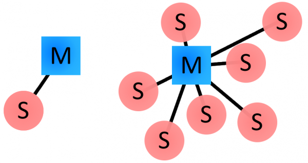
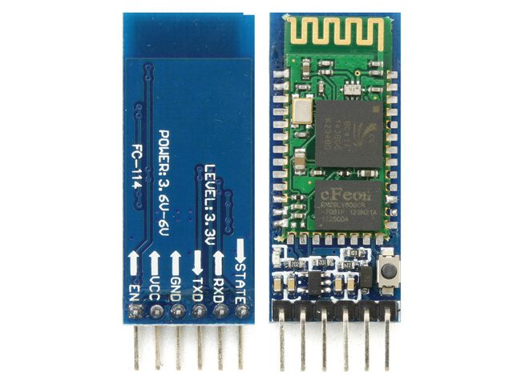

# BAB 6 - Serial Monitor HC-05

    

## Tujuan
Pada percobaan ini kita akan 

## Teori
### Bluetooth
Bluetooth merupakan protokol terstandarisasi untuk mengirim dan menerima data melalui jalur wireless pada frekuensi 2.4GHz. Jaringan Bluetooth atau biasa disebut dengan piconets bersifat ad-hoc dan menerapkan model master/slave. Sebuah devais master dapat terhubung maksimal tujuh devais slave dalam satu waktu yang sama. Sebuah devais slave hanya dapat terhubung ke satu devais master. Secara default, sebuah devais smartphone Android akan bertindak sebagai master pada sebuah jaringan piconets.

 
*Gambar 1 : Contoh topologi Piconets* 

### HC-05
HC-05 merupakan modul Bluetooth SPP (Serial Port Protocol) yang menerapkan komunikasi serial UART dengan perangkat MCU. Modul HC-05 dapat dioperasikan dengan tegangan 3.6-6V dengan baud rate 9600 pada *data mode*  dan baud rate 38400 pada *command mode*.

 
*Gambar 1 : Modul HC-05* 

## Codelab
1. Buatlah project baru pada Android Studio dengan kriteria sebagai berikut : 

| Field     | Isian |
| ---      | ---       |
| Nama Project  | **BluetoothSerialMonitor**   |
| Target & Minimum Target SDK  | **Phone and Tablet, API level 21**  |
| Tipe Activity | **Empty Activity** |
| Activity Name | **MainActivity** | 
| Language | **Java** |