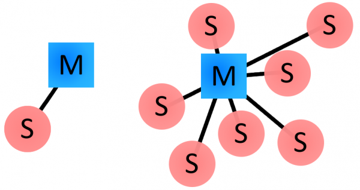

# BAB 6 - Android & NodeMCU - Bluetooth Serial Monitor


<a href="https://github.com/lefalya">
  
</a>
<a href="https://www.linkedin.com/in/berninofalya/">
  
</a>

<br/><br/><br/><br/>

## Tujuan
Pada percobaan ini kita akan mempraktikan komunikasi Bluetooth antara perangkat Android dan NodeMCU menggunakan modul HC05. Hasil akhir dari Codelab pada Bab ini adalah praktikan dapat mengirimkan pesan dari NodeMCU dengan bantuan modul HC05 ke perangkat Android melalui kanal Bluetooth secara satu arah, menjadikan perangkat Android bertindak selayaknya sebuah *Serial Monitor*. Codelab Bab ini menerapkan konsep *multi-threading* pada bagian akuisisi data pada perangkat Android. Pengkabelan antara perangkat NodeMCU dan HC05 untuk Bab 6 dapat dilihat pada laman berikut : ....

## Teori
### Bluetooth
Bluetooth merupakan teknologi nirkabel untuk mengirim dan menerima data pada frekuensi 2.4GHz. Jaringan Bluetooth atau biasa disebut dengan piconets bersifat *ad-hoc* dan menerapkan model master/slave. Sebuah master dapat terhubung maksimal tujuh slave. Sebuah slave hanya dapat terhubung ke satu master. **Secara default, sebuah smartphone Android akan bertindak sebagai master pada sebuah jaringan piconets.**  

<p align="center">
<br />
*Gambar 1 : Contoh topologi Piconets*<br />
</p>

Bluetooth terdiri dari dua jenis susunan protokol, yaitu *controller stack* dan *host stack*. Namun dalam Codelab Bab ini, pengaturan pada *controller stack* diabaikan dan memfokuskan pada penggunaan salah satu protokol pada *host stack* yaitu RFCOMM (Radio Frequency Communication). RFCOMM merupakan protokol yang menirukan sebuah port serial, menyediakan aliran data serupa dengan TCP. Penerapan protokol RFCOMM memungkinkan kita untuk mengirim pesan seperti "Hallo Dunia" secara mudah dan cepat. Android secara default menyediakan dukungan pada protokol RFCOMM melalui API `BluetoothDevice` dengan fungsi `createRfcommSocketToServiceRecord(UUID uuid)` dan `createInsecureRfcommSocketToServiceRecord(UUID uuid)`. Pada Codelab ini digunakan protokol RFCOMM mode Insecure. 

### HC05
HC05 merupakan modul Bluetooth SPP (Serial Port Protocol) yang menerapkan komunikasi serial UART dengan perangkat MCU. Modul HC05 dapat dioperasikan pada tegangan 3.6-6V dengan baud rate 9600 pada *data mode*  dan baud rate 38400 pada *command mode*.

<p align="center">
<br />
*Gambar 1 : Modul HC05*<br />
</p>

## Codelab
1. Buatlah project baru pada Android Studio dengan kriteria sebagai berikut : 

| Field     | Isian |
| ---      | ---       |
| Nama Project  | **BluetoothSerialMonitor**   |
| Target & Minimum Target SDK  | **Phone and Tablet, API level 21**  |
| Tipe Activity | **Empty Activity** |
| Activity Name | **MainActivity** | 
| Language | **Java** |

2. Ganti keseluruhan kode pada `activity_main.xml` dengan kode berikut : 
```xml 
<?xml version="1.0" encoding="utf-8"?>
<androidx.constraintlayout.widget.ConstraintLayout xmlns:android="http://schemas.android.com/apk/res/android"
    xmlns:app="http://schemas.android.com/apk/res-auto"
    xmlns:tools="http://schemas.android.com/tools"
    android:layout_width="match_parent"
    android:layout_height="match_parent"
    tools:context=".MainActivity">

    <TextView
        android:id="@+id/bluetoothResult"
        android:layout_width="wrap_content"
        android:layout_height="wrap_content"
        android:layout_marginTop="100dp"
        android:text="Hello World!"
        app:layout_constraintLeft_toLeftOf="parent"
        app:layout_constraintRight_toRightOf="parent"
        app:layout_constraintTop_toTopOf="parent" />

</androidx.constraintlayout.widget.ConstraintLayout>
```

3. Buatlah sebuah Interface dengan cara klik kanan pada folder package -> New -> Java Class. Akan muncul sebuah dialog *New Java Class* dan pilih Interface. Beri nama Interface tersebut `BluetoothSerialMonitorListener`.

4. Tambahkan kode berikut pada Interface `BluetoothSerialMonitorListener` : 
```java
package com.acsl.NAMA_PACKAGE;

public interface BluetoothSerialMonitorListener {
    void onIncomingMessage(String message);
}
```

Interface `BluetoothSerialMonitorListener` berfungsi sebagai kontrak yang harus dipenuhi oleh kelas pengguna (dalam kasus ini MainActivity) untuk dapat memanfaatkan kelas `BluetoothSerialMonitor` yang akan kita buat setelah ini.

5. Buatlah sebuah kelas baru dengan cara klik kanan pada folder package -> New -> Java Class. Akan muncul sebuah dialog *New Java Class* dan pilih Class. Beri nama kelas tersebut `BluetoothSerialMonitor`. Kelas `BluetoothSerialMonitor` bertanggung jawab atas keseluruhan komunikasi Bluetooth antara perangkat smartphone dengan HC05.

6. Tambahkan *dependencies* yang dibutuhkan pada kelas `BluetoothSerialMonitor` dengan menuliskan baris-baris berikut : 
```java
package com.acsl.NAMA_PACKAGE;

import android.bluetooth.BluetoothAdapter;
import android.bluetooth.BluetoothDevice;
import android.bluetooth.BluetoothSocket;
import android.os.Handler;

import java.io.IOException;
import java.util.Set;
import java.util.UUID;

public class BluetoothSerialMonitor {

}
```

7. Deklarasikan variable yang dibutuhkan oleh kelas `BluetoothSerialMonitor` dengan menambahkan baris kode berikut : 
```java
package com.acsl.NAMA_PACKAGE;

import android.bluetooth.BluetoothAdapter;
import android.bluetooth.BluetoothDevice;
import android.bluetooth.BluetoothSocket;
import android.os.Handler;

import java.io.IOException;
import java.util.Set;
import java.util.UUID;

public class BluetoothSerialMonitor {
  private boolean connected = true;
  private BluetoothAdapter mBluetoothAdapter = null;
  private BluetoothSocket mBluetoothSocket = null;
  private static final UUID myUUID = UUID.fromString("00001101-0000-1000-8000-00805F9B34FB");

  private BluetoothSerialMonitorListener blueListener;
  private Handler activityHandler;
}
```
* Variable `mBluetoothAdapter` berfungsi sebagai representasi modul Bluetooth yang tertanam pada perangkat smartphone. 
* Variable `mBluetoothSocket` berfungsi sebagai representasi socket RFCOMM antara perangkat smartphone dan HC05. 
* Variable `myUUID` berfungsi sebagai *unique identifier* dari perangkat Android, bertindak selayaknya sebuah nama. 
* Variable `blueListener` berfungsi sebagai representasi kelas pengguna dari BluetoothSerialMonitor, dalam kasus ini adalah `MainActivity`. Variable 


